**Author**: Mark E. Pepin, MD, PhD  
**Contact**: mepepin@bwh.harvard.edu 
**Institution**: Harvard Medical School  
**Location**: 77 Francis St, Boston, MA  

# Genome Assembly and Alignment

The first task is to align the bisulfite reduced and sequenced reads to a genome assembly. To accomplish this, I prepared the genome assembly based on Gencode annotation (gencode.v28.annotation.gtf) and sequence (GRCh38.p12.genome.fa). For whole-genome bisulfite sequencing via the Bismark (v0.20.0) aligner and genome preparation, a CT- and GA-converted assemblies are created.

## Genome Assembly

## Adapter and Read Quality Trimming

Once the genome assembly was created, adapter sequences were trimmed and sequencing quality assessed via trim_galore and FastQC, respectively.

`trim_galore -o $INPUT_DIR/fastq_trimmed/ --paired --rrbs --non_directional --length 20 --fastqc #$INPUT_DIR/fastq/${VAR}_R1_001.fastq.gz $INPUT_DIR/fastq/${VAR}_R2_001.fastq.gz.`

## Read Alignment

We then aligned all .fastq files to the genome assemblies using the following command:

###Run bismark

```r
bismark --bowtie2 -N 1 --bam $GENOME_DIR -1 $INPUT_DIR/fastq_trimmed/${VAR}_R1_001_val_1.fq.gz -2 $INPUT_DIR/fastq_trimmed/${VAR}_R2_001_val_2.fq.gz output_dir $RESULTS_DIR

###extract methylation per position
bismark_methylation_extractor \
-p --multicore 8 --no_overlap --report --bedGraph --gzip -o $RESULTS_DIR $RESULTS_DIR/${VAR}_R1_001_val_1_bismark_bt2_pe.bam
```

Once completed, the CpG methylation was extracted as both bedgraph file (for UCSC genome browser) and bed file, which was then used to identify differentially-methylated cytosines (DMCs) and differentially-methylated regions (DMRs).

The "*.counted" files that resulted from this process were then read into R () and combined into a single "object" for differential methylation analysis

# Differential Methylation Analysis

## Combining sample methylation


```r
library(openxlsx)
library(methylKit)
library(dplyr)
SEX=c("M", "F", NA)
ANALYSIS="AFib_vs_HS"
files.vector <- list.files(path = "../1_Input/RRBS", pattern = "*.cov", full.names = TRUE, all.files = TRUE)
#Generate Column names (remove the extra nonsense from the path names)
colnames <- gsub( "*_R1_001_val_1_bismark_bt2_pe.bismark.cov", "", files.vector) # delete generic areas
colnames <- gsub( paste0("[.][.]/1_Input/RRBS/"), "", colnames) # Delete path from name
colnames<-gsub("\\_.*","",colnames) # delete all characters after "_"
sample_id<-as.list(colnames)
#Import the Index file
Index.raw<-openxlsx::read.xlsx("../1_Input/colData.xlsx", rowNames = F)
Index.raw$Etiology<-factor(Index.raw$Etiology, levels = c("HS", "AF"))
Index.raw$Sex<-factor(Index.raw$Sex, levels = c("M", "F"))
## Sort the index according to the .bed file ordering (as imported).
Index_sorted<-subset(Index.raw, Sample_ID %in% colnames)
Index_filtered<-subset(Index_sorted, Sex %in% SEX)
Test<-Index_filtered[order(Index_filtered$Sample_ID),]
meth_names<-as.list(Index_filtered$Sample_ID)
##Create a methlRawlistDB
file.list<-as.list(unique(grep(paste(paste0(Index_filtered$Sample_ID, "_"), collapse="|"), 
                        files.vector, value=TRUE)))
myobj_filtered<-methRead(location = file.list, sample.id = meth_names, assembly = "hg38", treatment=Index_filtered$Etiology, pipeline = "bismarkCoverage", header = FALSE, context = "CpG")
##Example of sample statistics (can spot check these)
getMethylationStats(myobj_filtered[[3]], plot = F, both.strands = F)
```

```
## methylation statistics per base
## summary:
##    Min. 1st Qu.  Median    Mean 3rd Qu.    Max. 
##    0.00    0.00   10.00   38.55   91.67  100.00 
## percentiles:
##        0%       10%       20%       30%       40%       50%       60%       70% 
##   0.00000   0.00000   0.00000   0.00000   0.00000  10.00000  40.00000  85.71429 
##       80%       90%       95%       99%     99.5%     99.9%      100% 
##  94.44444 100.00000 100.00000 100.00000 100.00000 100.00000 100.00000
```

```r
#Subset the methylRawList to include only the sample_id's for the desired analysis
# myobj_filtered<-reorganize(myobj, sample.ids = Index_filtered$WGBS_ID, treatment = Index_filtered$Timing)
```


Once the samples have been compiled, it is valuable to perform some basic visualizations and statistics to determine whether quality filtering is necessary. The distribution of methylation change is plotted as a histogram (typically bimodal at the extremes), as well as a distribution of the read coverage per based, again plotted as a histogram. For the latter plot, it is important to determine whether PCR duplication biases the read coverage. If so, a secondary peak would emerge on the right-most portion of the histogram. In the current analysis, coverage distribution exhibits a one-tailed distribution, suggesting that the "deduplication" step in the alignment effectively eliminated the PCR amplification bias in coverage.


```r
library(graphics)
getMethylationStats(myobj_filtered[[2]], plot = T, both.strands = F)
```

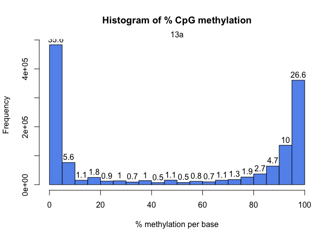<!-- -->

```r
getCoverageStats(myobj_filtered[[2]], plot = T, both.strands = F)
```

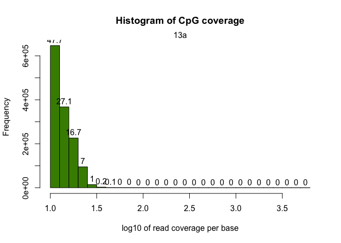<!-- -->

```r
#Save these files in an output folder
ifelse(!dir.exists(file.path("../2_Output/", ANALYSIS)), dir.create(file.path("../2_Output/", ANALYSIS)), FALSE)
```

```
## [1] FALSE
```

```r
pdf(file=paste0("../2_Output/", ANALYSIS, "/", ANALYSIS, "_Methylation.Stats.pdf"))
getMethylationStats(myobj_filtered[[2]], plot = T, both.strands = F)
dev.off()
```

```
## quartz_off_screen 
##                 2
```

```r
pdf(file=paste0("../2_Output/", ANALYSIS, "/", ANALYSIS, "_Coverage.Stats.pdf"))
getCoverageStats(myobj_filtered[[2]], plot = T, both.strands = F)
dev.off()
```

```
## quartz_off_screen 
##                 2
```

Although most important in the context of correcting PCR-bias (duplication), filtering samples based on coverage also reduces false discovery based on low-coverage genomic regions. If PCR bias exists, an artificially high coverage would exist. Low coverage is also a concern due to low statistical power associated with low-coverage regions. Below, we discard bases with coverage below 10X, but also discard bases with coverage > 99.9th percentile.


```r
#remove exceedingly high-coverage (risk of PCR bias) or low-coverage DMPs (low statistical power) 
filtered.myobj <- filterByCoverage(myobj_filtered, lo.count = 5, lo.perc = NULL, hi.count = NULL, hi.perc = 99.9)
```

##Visualizing Methylation


```r
#destrand and unite the sample data
meth<-unite(filtered.myobj) #When calculating DMRs, it is not helpful to "destrand"
clusterSamples(meth, dist = "correlation", method = "ward", plot = TRUE)
```

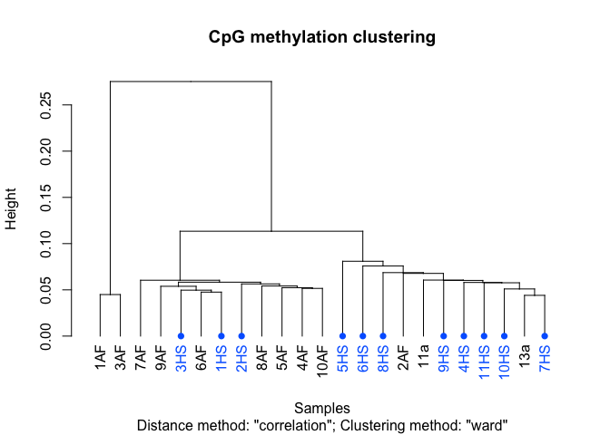<!-- -->

```
## 
## Call:
## hclust(d = d, method = HCLUST.METHODS[hclust.method])
## 
## Cluster method   : ward.D 
## Distance         : pearson 
## Number of objects: 23
```

```r
PCASamples(meth, screeplot = TRUE)
```

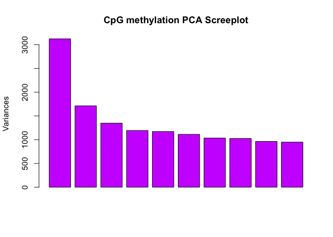<!-- -->

```r
PCASamples(meth)
```

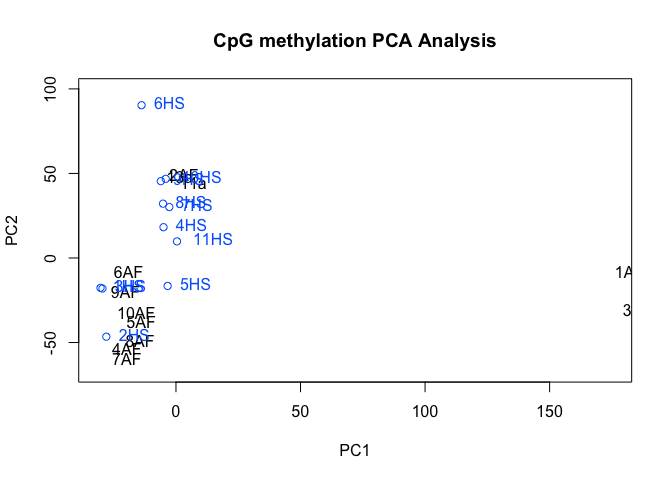<!-- -->

```r
#Create a folder in which to generate all documents/tables for this analysyis
ifelse(!dir.exists(file.path("../2_Output/", ANALYSIS)), dir.create(file.path("../2_Output/", ANALYSIS)), FALSE)
```

```
## [1] FALSE
```

```r
#Create dendrogram and PCA plots
pdf(file=paste0("../2_Output/", ANALYSIS, "/", ANALYSIS, "_Clustering.pdf"))
clusterSamples(meth, dist = "correlation", method = "ward", plot = TRUE)
```

```
## 
## Call:
## hclust(d = d, method = HCLUST.METHODS[hclust.method])
## 
## Cluster method   : ward.D 
## Distance         : pearson 
## Number of objects: 23
```

```r
PCASamples(meth, screeplot = TRUE)
PCASamples(meth)
dev.off()
```

```
## quartz_off_screen 
##                 2
```


##Tiling Methylation Windows


```r
library(dplyr)
##################################
#Differential Methylation of Tiles
##################################
tiles = tileMethylCounts(myobj_filtered, win.size = 500, step.size = 500)
meth_tile<-unite(tiles, destrand = FALSE) #When calculating DMRs, it is not helpful to "destrand"
myDiff_tiles=calculateDiffMeth(meth_tile, test = "Chisq", adjust = "SLIM", mc.cores = 7)
myDiff_tile.md<-as(myDiff_tiles,"methylDiff")
myDiff_test<-as.data.frame(myDiff_tile.md)
write.csv(myDiff_test, paste0("../2_Output/", ANALYSIS, "DMR.csv"))
myDiff_test<-read.csv(paste0("../2_Output/", ANALYSIS, "DMR.csv"))
myDiff_tiles.filtered<-dplyr::select(myDiff_test, chr, start, end, strand, meth.diff, pvalue, qvalue)

#Check clustering of samples by DMR correlation
clusterSamples(meth_tile, dist = "correlation", method = "ward", plot = TRUE)
```

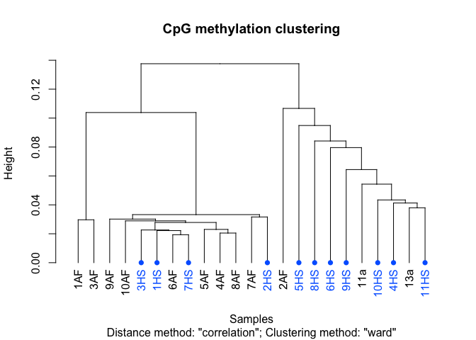<!-- -->

```
## 
## Call:
## hclust(d = d, method = HCLUST.METHODS[hclust.method])
## 
## Cluster method   : ward.D 
## Distance         : pearson 
## Number of objects: 23
```

```r
PCASamples(meth_tile, screeplot = TRUE)
```

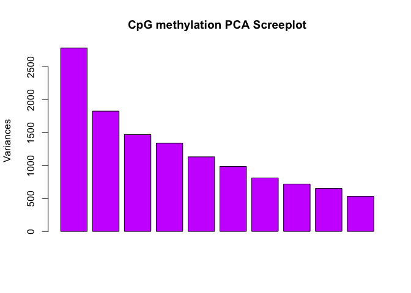<!-- -->

```r
PCASamples(meth_tile)
```

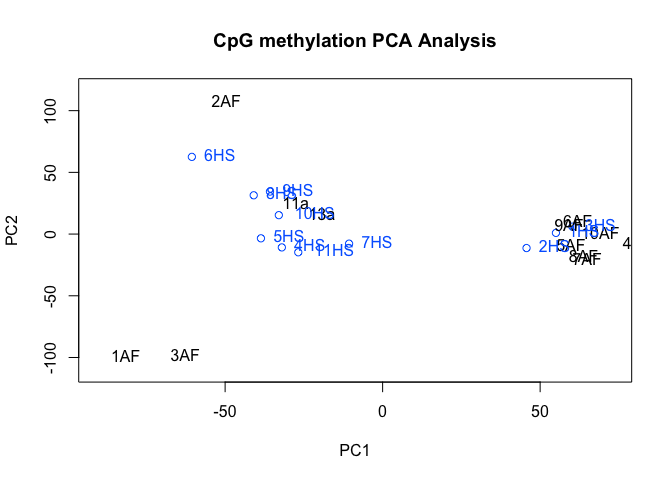<!-- -->

```r
#Create a folder in which to generate all documents/tables for this analysyis
ifelse(!dir.exists(file.path("../2_Output/", ANALYSIS, "DMR/")), dir.create(file.path("../2_Output/", ANALYSIS, "DMR/")), FALSE)
```

```
## [1] FALSE
```

```r
#Create dendrogram and PCA plots
pdf(file=paste0("../2_Output/", ANALYSIS, "/DMR/", ANALYSIS, "_Clustering.pdf"))
clusterSamples(meth_tile, dist = "correlation", method = "ward", plot = TRUE)
```

```
## 
## Call:
## hclust(d = d, method = HCLUST.METHODS[hclust.method])
## 
## Cluster method   : ward.D 
## Distance         : pearson 
## Number of objects: 23
```

```r
PCASamples(meth, screeplot = TRUE)
PCASamples(meth)
dev.off()
```

```
## quartz_off_screen 
##                 2
```

```r
##############################################
#Calculate percent methylation for each sample/site
##############################################

Methylation<-as.data.frame(meth_tile)
write.csv(Methylation, "Methylation.csv")
Methylation<-read.csv("Methylation.csv", row.names = 1)
f = function(Cyt, cov, col_name) {
  require(lazyeval)
  require(dplyr)
    mutate_call = lazyeval::interp(~ (a / b)*100, a = as.name(Cyt), b = as.name(cov))
    Methylation %>% mutate_(.dots = setNames(list(mutate_call), col_name))
}
for(i in seq_along(Index_sorted$Sample_ID)){
  COVERAGE=paste0("coverage", i)
  mC=paste0("numCs", i)
  perc.mC=paste0("perc.mC_", Index_sorted$Sample_ID[i])
  Methylation<-f(Cyt=mC, cov=COVERAGE, col_name=perc.mC)
}
Methylation<-dplyr::select(Methylation, chr, start, end, contains("perc.mC"))

#Merge with the percent methylation (by cytosine)
myDiff_tiles.filtered<-left_join(myDiff_tiles.filtered, Methylation)

#Subset by statistical threshold
myDiff.tiles_p05<-dplyr::filter(myDiff_tiles.filtered, pvalue<0.05)
myDiff.tiles_q05<-dplyr::filter(myDiff_tiles.filtered, qvalue<0.05)

#Save a copy of the differential Methylation analysis
wb_countData<-createWorkbook()
addWorksheet(wb_countData, "P < 0.05")
  writeData(wb_countData, "P < 0.05", myDiff.tiles_p05, rowNames = F)
addWorksheet(wb_countData, "Q < 0.05")
  writeData(wb_countData, "Q < 0.05", myDiff.tiles_q05, rowNames = F)
saveWorkbook(wb_countData, file = paste0("../2_Output/", ANALYSIS, "/DMR/", ANALYSIS, "_DiffMeth.xlsx"), overwrite = TRUE)

myDiff.files_q05_GR<-makeGRangesFromDataFrame(myDiff.tiles_q05, seqnames.field = "chr", strand.field="strand", start.field = "start", end.field = "end", keep.extra.columns = T)

write.table(myDiff.tiles_q05, file = "../2_Output/Tiles_Q05_DiffMeth.bed", sep = "\t", row.names = F, col.names = F, quote = F)

############################
##ANNOTATION
############################
library(openxlsx)
library(annotatr)
library(AnnotationHub)
library(rtracklayer)
library(TxDb.Hsapiens.UCSC.hg38.knownGene)
#convert to GRanges object (correct format for annotatr)
myDiff.tiles_p05_GR<-makeGRangesFromDataFrame(myDiff.tiles_p05, seqnames.field = "chr", strand.field="strand", start.field = "start", end.field = "end", keep.extra.columns = T)
#create annotations from the following sources
annots = c('hg38_cpgs', 'hg38_basicgenes')
# Build the annotations (a single GRanges object)
annotations = build_annotations(genome = 'hg38', annotations = annots)
# myDiff_GR<-as(myDiff, "GRanges")
# Intersect the regions read in with the annotations
dm_annotated.tiles = annotate_regions(
    regions = myDiff.tiles_p05_GR,
    annotations = annotations,
    ignore.strand = TRUE,
    quiet = FALSE)
#convert to a data.frame
df_dm_annotated.tiles = data.frame(dm_annotated.tiles)
# A GRanges object is returned
print(dm_annotated.tiles)
```

```
## GRanges object with 148009 ranges and 27 metadata columns:
##            seqnames        ranges strand | meth.diff      pvalue      qvalue
##               <Rle>     <IRanges>  <Rle> | <numeric>   <numeric>   <numeric>
##        [1]     chr1 631501-632000      * |  -1.96421   0.0151917   0.0474242
##        [2]     chr1 631501-632000      * |  -1.96421   0.0151917   0.0474242
##        [3]     chr1 631501-632000      * |  -1.96421   0.0151917   0.0474242
##        [4]     chr1 631501-632000      * |  -1.96421   0.0151917   0.0474242
##        [5]     chr1 631501-632000      * |  -1.96421   0.0151917   0.0474242
##        ...      ...           ...    ... .       ...         ...         ...
##   [148005]     chrM   13001-13500      * |   4.34728 4.31635e-07 8.91184e-06
##   [148006]     chrM   13001-13500      * |   4.34728 4.31635e-07 8.91184e-06
##   [148007]     chrM   13001-13500      * |   4.34728 4.31635e-07 8.91184e-06
##   [148008]     chrM   13001-13500      * |   4.34728 4.31635e-07 8.91184e-06
##   [148009]     chrM   13001-13500      * |   4.34728 4.31635e-07 8.91184e-06
##            perc.mC_11a perc.mC_13a perc.mC_1AF perc.mC_2AF perc.mC_3AF
##              <numeric>   <numeric>   <numeric>   <numeric>   <numeric>
##        [1]     26.4706     24.4216     87.7193     15.7447     74.5098
##        [2]     26.4706     24.4216     87.7193     15.7447     74.5098
##        [3]     26.4706     24.4216     87.7193     15.7447     74.5098
##        [4]     26.4706     24.4216     87.7193     15.7447     74.5098
##        [5]     26.4706     24.4216     87.7193     15.7447     74.5098
##        ...         ...         ...         ...         ...         ...
##   [148005]     17.5325     14.4231     2.94118     10.8696           0
##   [148006]     17.5325     14.4231     2.94118     10.8696           0
##   [148007]     17.5325     14.4231     2.94118     10.8696           0
##   [148008]     17.5325     14.4231     2.94118     10.8696           0
##   [148009]     17.5325     14.4231     2.94118     10.8696           0
##            perc.mC_4AF perc.mC_5AF perc.mC_6AF perc.mC_7AF perc.mC_8AF
##              <numeric>   <numeric>   <numeric>   <numeric>   <numeric>
##        [1]     27.8511     25.7683     33.2727     30.8458     33.4669
##        [2]     27.8511     25.7683     33.2727     30.8458     33.4669
##        [3]     27.8511     25.7683     33.2727     30.8458     33.4669
##        [4]     27.8511     25.7683     33.2727     30.8458     33.4669
##        [5]     27.8511     25.7683     33.2727     30.8458     33.4669
##        ...         ...         ...         ...         ...         ...
##   [148005]     30.0824     24.1758     26.7974     26.7943     27.0042
##   [148006]     30.0824     24.1758     26.7974     26.7943     27.0042
##   [148007]     30.0824     24.1758     26.7974     26.7943     27.0042
##   [148008]     30.0824     24.1758     26.7974     26.7943     27.0042
##   [148009]     30.0824     24.1758     26.7974     26.7943     27.0042
##            perc.mC_9AF perc.mC_10AF perc.mC_1HS perc.mC_2HS perc.mC_3HS
##              <numeric>    <numeric>   <numeric>   <numeric>   <numeric>
##        [1]     19.3322      19.2747          25     24.4214      27.186
##        [2]     19.3322      19.2747          25     24.4214      27.186
##        [3]     19.3322      19.2747          25     24.4214      27.186
##        [4]     19.3322      19.2747          25     24.4214      27.186
##        [5]     19.3322      19.2747          25     24.4214      27.186
##        ...         ...          ...         ...         ...         ...
##   [148005]     31.4516      28.7265     26.9886     25.3125     25.7184
##   [148006]     31.4516      28.7265     26.9886     25.3125     25.7184
##   [148007]     31.4516      28.7265     26.9886     25.3125     25.7184
##   [148008]     31.4516      28.7265     26.9886     25.3125     25.7184
##   [148009]     31.4516      28.7265     26.9886     25.3125     25.7184
##            perc.mC_4HS perc.mC_5HS perc.mC_6HS perc.mC_7HS perc.mC_8HS
##              <numeric>   <numeric>   <numeric>   <numeric>   <numeric>
##        [1]     22.6994     40.5573     24.6973     39.7306     23.4568
##        [2]     22.6994     40.5573     24.6973     39.7306     23.4568
##        [3]     22.6994     40.5573     24.6973     39.7306     23.4568
##        [4]     22.6994     40.5573     24.6973     39.7306     23.4568
##        [5]     22.6994     40.5573     24.6973     39.7306     23.4568
##        ...         ...         ...         ...         ...         ...
##   [148005]     20.8333     14.5985     17.8744     19.4539     10.6383
##   [148006]     20.8333     14.5985     17.8744     19.4539     10.6383
##   [148007]     20.8333     14.5985     17.8744     19.4539     10.6383
##   [148008]     20.8333     14.5985     17.8744     19.4539     10.6383
##   [148009]     20.8333     14.5985     17.8744     19.4539     10.6383
##            perc.mC_9HS perc.mC_10HS perc.mC_11HS                annot
##              <numeric>    <numeric>    <numeric>            <GRanges>
##        [1]     36.3144      23.1467      34.2105 chr1:631757-632756:+
##        [2]     36.3144      23.1467      34.2105 chr1:631205-632204:-
##        [3]     36.3144      23.1467      34.2105 chr1:631151-632150:-
##        [4]     36.3144      23.1467      34.2105 chr1:627757-631756:+
##        [5]     36.3144      23.1467      34.2105 chr1:628535-632534:+
##        ...         ...          ...          ...                  ...
##   [148005]     15.2866      13.2832       10.241     chrM:-3329-670:+
##   [148006]     15.2866      13.2832       10.241    chrM:9747-13746:+
##   [148007]     15.2866      13.2832       10.241   chrM:10888-14887:+
##   [148008]     15.2866      13.2832       10.241   chrM:12337-14148:+
##   [148009]     15.2866      13.2832       10.241       chrM:1-16569:*
##   -------
##   seqinfo: 39 sequences from an unspecified genome; no seqlengths
```

```r
##The issue with this annotation is that each DMP has multiple repeated rows if different annotations. To simplify this, we can condense the annotations into strings. This makes the resulting file more manageable based on the differential-methylation data.
DiffMeth_Annotated.tiles<-df_dm_annotated.tiles %>% 
  tidyr::fill(annot.symbol) %>% distinct() %>%
  dplyr::group_by(seqnames, start, end, meth.diff, pvalue, qvalue, annot.symbol) %>% 
  dplyr::summarise(Annotation=paste(unique(annot.type), collapse = ";"), Test=paste(unique(annot.id), collapse = ";"))
#Add %Methylation
DiffMeth_Annotated.tiles<-dplyr::rename(DiffMeth_Annotated.tiles, chr=seqnames)
DiffMeth_Annotated.tiles<-dplyr::left_join(DiffMeth_Annotated.tiles, Methylation)
#subset the Differential Methylation by statistics
DiffMeth_Annotated.tiles_p05<-subset(DiffMeth_Annotated.tiles, pvalue<0.05)
DiffMeth_Annotated.tiles_q05<-subset(DiffMeth_Annotated.tiles, qvalue<0.05)
#Write out the annotated DMP file 
library(openxlsx)
ifelse(!dir.exists(file.path("../2_Output/", ANALYSIS, "/DMR/")), dir.create(file.path("../2_Output/", ANALYSIS, "/DMR/")), FALSE)
```

```
## [1] FALSE
```

```r
wb_WGBS_Annotate<-createWorkbook()
addWorksheet(wb_WGBS_Annotate, "P < 0.05")
  writeData(wb_WGBS_Annotate, "P < 0.05", DiffMeth_Annotated.tiles_p05, rowNames = F)
addWorksheet(wb_WGBS_Annotate, "Q < 0.05")
  writeData(wb_WGBS_Annotate, "Q < 0.05", DiffMeth_Annotated.tiles_q05, rowNames = F)
saveWorkbook(wb_WGBS_Annotate, file = paste0("../2_Output/", ANALYSIS, "/DMR/", ANALYSIS, "_Annotated_DiffMeth.xlsx"), overwrite = TRUE)
#Provide a summary of the annotation
dm_annsum.tile = summarize_annotations(
    annotated_regions = dm_annotated.tiles,
    quiet = TRUE)
print(dm_annsum.tile)
```

```
## # A tibble: 10 × 2
##    annot.type               n
##    <chr>                <int>
##  1 hg38_cpg_inter        2726
##  2 hg38_cpg_islands      6250
##  3 hg38_cpg_shelves       382
##  4 hg38_cpg_shores       4979
##  5 hg38_genes_1to5kb     4369
##  6 hg38_genes_3UTRs       600
##  7 hg38_genes_5UTRs      3328
##  8 hg38_genes_exons      5934
##  9 hg38_genes_introns    7242
## 10 hg38_genes_promoters  5282
```

```r
#Plot the annotation distribution
dm_vs_kg_annotations.tile = plot_annotation(
    annotated_regions = dm_annotated.tiles,
    plot_title = '# of Sites Tested',
    x_label = 'knownGene Annotations',
    y_label = 'Count')
print(dm_vs_kg_annotations.tile)
```

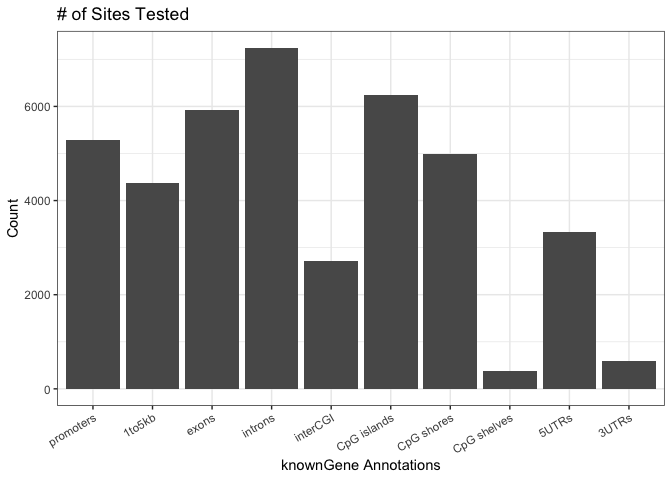<!-- -->

```r
annots_order = c(
    'hg38_genes_1to5kb',
    'hg38_genes_promoters',
    'hg38_genes_5UTRs',
    'hg38_genes_exons',
    'hg38_genes_introns',
    'hg38_genes_3UTRs')
dm_vs_kg_annotations = plot_annotation(
    annotated_regions = dm_annotated.tiles,
    annotation_order = annots_order,
    plot_title = '# of Sites Tested for differentially-methylated positions',
    x_label = 'knownGene Annotations',
    y_label = 'Count')
print(dm_vs_kg_annotations)
```

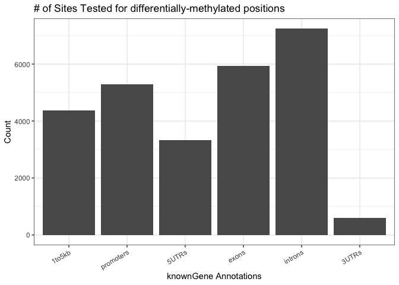<!-- -->

#Heatmap of Differential Methylation


```r
library(pheatmap)
hm_Data<-as.data.frame(DiffMeth_Annotated.tiles_q05)
hm_Data<-hm_Data[!is.na(hm_Data$annot.symbol),]
rownames(hm_Data)<-make.unique(hm_Data$annot.symbol, sep = ".")
hm_Data_filtered<-hm_Data %>% filter(qvalue < 0.001, abs(meth.diff) > 10) %>% dplyr::select(contains("perc.mC")) %>% data.matrix(hm_Data)

##Index file for annotating samples
hm_Index<-Index.raw
hm_Index$Sample_ID<-paste0("perc.mC_", hm_Index$Sample_ID)
rownames(hm_Index)<-hm_Index$Sample_ID
hm_Index<-as.data.frame(hm_Index)
hm_Index<-dplyr::select(hm_Index, Sample_ID, Etiology, Sex)

paletteLength <- 100
myColor <- colorRampPalette(c("dodgerblue4", "white", "gold2"))(paletteLength)
library(pheatmap)
pheatmap(hm_Data_filtered,
         cluster_cols=T, 
         border_color=NA, 
         cluster_rows=T, 
         scale = 'row',
         show_colnames = T, 
         show_rownames = F, 
         color = myColor,
         annotation_col = hm_Index)
```

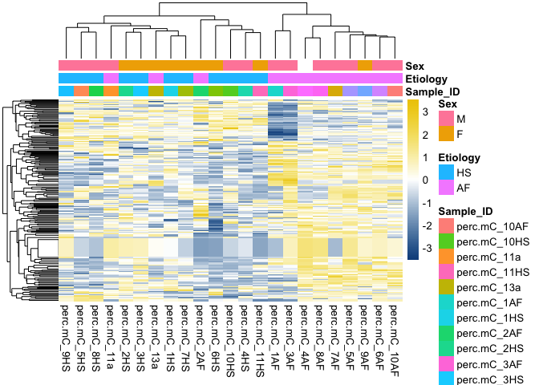<!-- -->

#DMP Distribution: Manhattan plot


```r
library(qqman)
man_data<-dplyr::rename(DiffMeth_Annotated.tiles_p05, CHR=chr, BP=start, P=pvalue, SNP=annot.symbol)
man_data$CHR<-sub("chr","", man_data$CHR)
man_data<-dplyr::filter(man_data, CHR!="Y")
man_data$CHR<-gsub("X", "23", man_data$CHR)
man_data$CHR<-gsub("M", "25", man_data$CHR)
man_data$CHR<-as.numeric(man_data$CHR)
ANNOTATE<-unique(filter(man_data, P<0.00000001)$SNP)
manhattan(man_data, chr = "CHR", bp = "BP", p = "P", snp = "SNP",
      col = c("black","#666666","#CC6600"), chrlabs = c(1:22, "X", "MT"),
      suggestiveline = -log10(1e-05), genomewideline = -log10(5e-08),
      highlight = ANNOTATE, logp = TRUE, annotatePval = 1e-10, annotateTop = F, cex=0.5)
```

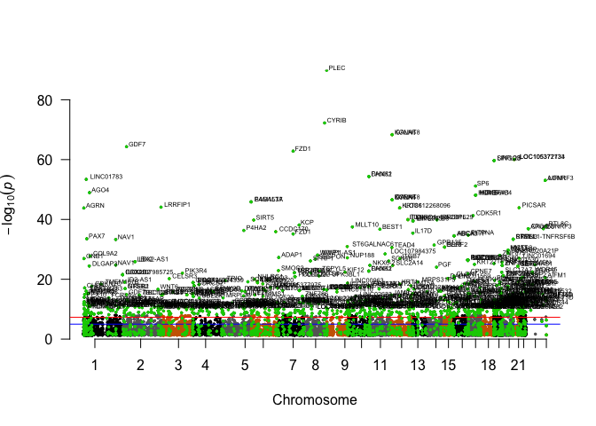<!-- -->

```r
#Make PDF
pdf(file = paste0("../2_Output/", ANALYSIS, "/", ANALYSIS, "_Manhattan.pdf"), height=3, width=5)
manhattan(man_data, chr = "CHR", bp = "BP", p = "P", snp = "SNP",
      col = c("black","#666666","#CC6600"), chrlabs = c(1:22, "X", "MT"),
      suggestiveline = -log10(1e-8), genomewideline = -log10(5e-10),
      logp = TRUE, annotatePval = 1e-08, annotateTop = F, cex=0.5)
dev.off()
```

```
## quartz_off_screen 
##                 2
```

##Volcano Plot


```r
# Load packages
# Load packages
library(ggplot2)
library(ggrepel)
library(openxlsx)
df_dm_annotated.tiles = data.frame(dm_annotated.tiles)
# Read data from the web
options(ggrepel.max.overlaps = Inf)
results <- dplyr::select(df_dm_annotated.tiles, annot.symbol, meth.diff, pvalue) %>% mutate(., sig=ifelse(pvalue<0.05 & meth.diff>5, "P_0.05 and Methylation > 5%", ifelse(pvalue<0.05 & meth.diff< -5,"P_0.05 and Methylation < 5%", "Not Sig")), minuslogpvalue = -log(pvalue), Methylation=meth.diff) %>% distinct()
max(results$minuslogpvalue, na.rm = TRUE)
```

```
## [1] 206.9374
```

```r
max(results$Methylation, na.rm = TRUE)
```

```
## [1] 27.81811
```

```r
min(results$Methylation, na.rm = TRUE)
```

```
## [1] -34.1164
```

```r
p = ggplot(results, aes(Methylation, minuslogpvalue)) + theme(panel.background = element_rect("white", colour = "black", size=0), panel.grid.major = element_line(colour = "gray50", size=0), panel.grid.minor = element_line(colour = "gray50", size=0)) +
geom_point(aes(fill=sig, size = minuslogpvalue), colour="grey", shape=21, stroke = 0, alpha = 8/10) + labs(x=expression(Methylation), y=expression(-Log[10](P-value))) + xlim(min(results$Methylation, na.rm = TRUE),max(results$Methylation, na.rm = TRUE))+ ylim(-0, max(results$minuslogpvalue, na.rm = TRUE)) + geom_hline(yintercept = 0, size = 1) + geom_vline(xintercept=0, size=1)+
  scale_fill_manual(values=c("grey","darkcyan", "tomato")) +
  scale_size_continuous(range = c(.1, 2))
  p+
  geom_text_repel(data=top_n(filter(results, pvalue<0.05), 15, Methylation), aes(label=annot.symbol)) +
  geom_text_repel(data=top_n(filter(results, pvalue<0.05), 15, -Methylation), aes(label=annot.symbol))
```

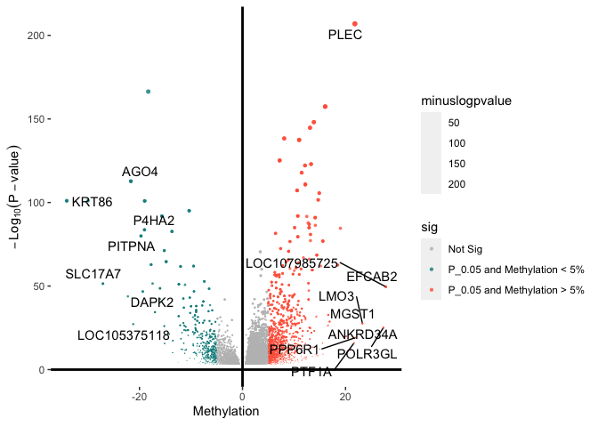<!-- -->

```r
pdf(file = paste0("../2_Output/", ANALYSIS, "/", ANALYSIS, "Volcano.Plot.pdf"))
  p+
  geom_text_repel(data=top_n(filter(results, pvalue<0.05), 15, Methylation), aes(label=annot.symbol)) +
  geom_text_repel(data=top_n(filter(results, pvalue<0.05), 15, -Methylation), aes(label=annot.symbol))
dev.off()
```

```
## quartz_off_screen 
##                 2
```


#Methylation Distribution using **EnrichedHeatmap**


```r
#Import the genomic annotation file
library(EnrichedHeatmap)
library(annotatr)
library(TxDb.Hsapiens.UCSC.hg38.knownGene)
annots = c("hg38_basicgenes", "hg38_genes_promoters", "hg38_genes_intergenic",
           "hg38_genes_intronexonboundaries", "hg38_cpgs", "hg38_cpg_islands", "hg38_cpg_shores", "hg38_cpg_shelves", "hg38_cpg_inter")
annotations=build_annotations(genome = "hg38", annotations = annots)
annotations<-keepStandardChromosomes(annotations, pruning.mode = "coarse") #Remove nonstandard chromosomes

myDiff.tiles_p05<-dplyr::mutate(myDiff.tiles_p05, absolute.meth=abs(meth.diff))
myDiff.tiles_p05<-as(myDiff.tiles_p05, "GRanges")

#Annotate GRanges using hg38 genome
dm_annotated = annotate_regions(
  regions = myDiff.tiles_p05,
  annotations = annotations,
  ignore.strand = TRUE)
#create data.frame
df_dm_annotated <- as.data.frame(dm_annotated)
#
library(GenomicFeatures)
genes<-genes(TxDb.Hsapiens.UCSC.hg38.knownGene)
tss = promoters(genes, upstream = 0, downstream = 1)
mat1 = normalizeToMatrix(myDiff.tiles_p05, tss, value_column = "absolute.meth", extend = 5000, mean_mode="w0", w=50, keep = c(0, 0.99))
EnrichedHeatmap(mat1, col = c("white", "black"), name = ANALYSIS)
```

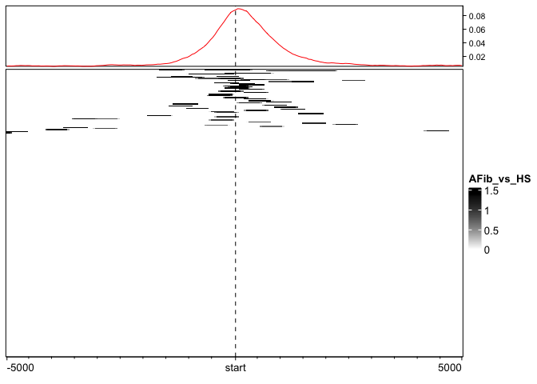<!-- -->

```r
# 
# png(file = paste0("../2_Output/2_Methyl/", ANALYSIS, "/","_1Methyl.Gene.Distribution.png"), height = 3, width = 5)
# EnrichedHeatmap(mat1, col = c("white", "black"), name = "Heart Failure")
# dev.off()

partition = kmeans(mat1, centers = 3)$cluster
lgd = Legend(at = c("cluster1", "cluster2", "cluster3"), title = "Clusters", 
    type = "lines", legend_gp = gpar(col = 2:4))
ht_list = Heatmap(partition, col = structure(2:4, names = as.character(1:3)), name = "partition",
              show_row_names = FALSE, width = unit(3, "mm")) + EnrichedHeatmap(mat1, col = c("white", "red"), name = "|PercentMethylation|", split = partition, top_annotation = HeatmapAnnotation(lines = anno_enriched(gp = gpar(col = 2:4))), column_title = "|PercentMethylation|")
draw(ht_list, main_heatmap = "|PercentMethylation|")
```

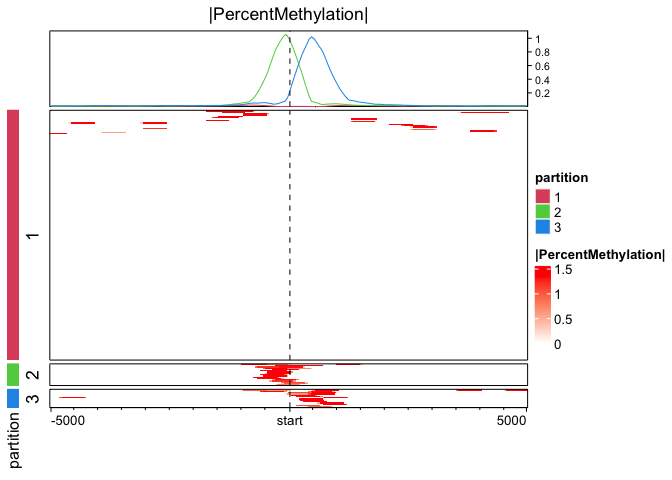<!-- -->

```r
partition = kmeans(mat1, centers = 2)$cluster
lgd = Legend(at = c("cluster1", "cluster2"), title = "Clusters", 
    type = "lines", legend_gp = gpar(col = 2:3))
ht_list = Heatmap(partition, col = structure(2:3, names = as.character(1:2)), name = "partition",
              show_row_names = FALSE, width = unit(3, "mm")) + EnrichedHeatmap(mat1, col = c("white", "red"), name = "|PercentMethylation|", split = partition, top_annotation = HeatmapAnnotation(lines = anno_enriched(gp = gpar(col = 2:3))), column_title = "|PercentMethylation|")
pdf(file = paste0("../2_Output/", ANALYSIS, "/", ANALYSIS, "_Methyl.Gene.Distribution_Kmeans.pdf"), height = 7, width = 5)
draw(ht_list, main_heatmap = "|PercentMethylation|")
dev.off()
```

```
## quartz_off_screen 
##                 2
```


#Supplemental Table: R Session Information

All packages and setting are acquired using the following command: 

```r
sinfo<-devtools::session_info()
sinfo$platform
```

```
##  setting  value
##  version  R version 4.2.2 (2022-10-31)
##  os       macOS Big Sur ... 10.16
##  system   x86_64, darwin17.0
##  ui       X11
##  language (EN)
##  collate  en_US.UTF-8
##  ctype    en_US.UTF-8
##  tz       America/New_York
##  date     2023-01-28
##  pandoc   2.19.2 @ /Applications/RStudio.app/Contents/Resources/app/quarto/bin/tools/ (via rmarkdown)
```

```r
sinfo$packages %>% kable( 
                         align="c", 
                         longtable=T, 
                         booktabs=T,
                         caption="Packages and Required Dependencies") %>% 
    kable_styling(latex_options=c("striped", "repeat_header", "condensed"))
```

<table class="table" style="margin-left: auto; margin-right: auto;">
<caption>Packages and Required Dependencies</caption>
 <thead>
  <tr>
   <th style="text-align:left;">   </th>
   <th style="text-align:center;"> package </th>
   <th style="text-align:center;"> ondiskversion </th>
   <th style="text-align:center;"> loadedversion </th>
   <th style="text-align:center;"> path </th>
   <th style="text-align:center;"> loadedpath </th>
   <th style="text-align:center;"> attached </th>
   <th style="text-align:center;"> is_base </th>
   <th style="text-align:center;"> date </th>
   <th style="text-align:center;"> source </th>
   <th style="text-align:center;"> md5ok </th>
   <th style="text-align:center;"> library </th>
  </tr>
 </thead>
<tbody>
  <tr>
   <td style="text-align:left;"> AnnotationDbi </td>
   <td style="text-align:center;"> AnnotationDbi </td>
   <td style="text-align:center;"> 1.60.0 </td>
   <td style="text-align:center;"> 1.60.0 </td>
   <td style="text-align:center;"> /Library/Frameworks/R.framework/Versions/4.2/Resources/library/AnnotationDbi </td>
   <td style="text-align:center;"> /Library/Frameworks/R.framework/Versions/4.2/Resources/library/AnnotationDbi </td>
   <td style="text-align:center;"> TRUE </td>
   <td style="text-align:center;"> FALSE </td>
   <td style="text-align:center;"> 2022-11-01 </td>
   <td style="text-align:center;"> Bioconductor </td>
   <td style="text-align:center;">  </td>
   <td style="text-align:center;"> /Library/Frameworks/R.framework/Versions/4.2/Resources/library </td>
  </tr>
  <tr>
   <td style="text-align:left;"> AnnotationHub </td>
   <td style="text-align:center;"> AnnotationHub </td>
   <td style="text-align:center;"> 3.6.0 </td>
   <td style="text-align:center;"> 3.6.0 </td>
   <td style="text-align:center;"> /Library/Frameworks/R.framework/Versions/4.2/Resources/library/AnnotationHub </td>
   <td style="text-align:center;"> /Library/Frameworks/R.framework/Versions/4.2/Resources/library/AnnotationHub </td>
   <td style="text-align:center;"> TRUE </td>
   <td style="text-align:center;"> FALSE </td>
   <td style="text-align:center;"> 2022-11-01 </td>
   <td style="text-align:center;"> Bioconductor </td>
   <td style="text-align:center;">  </td>
   <td style="text-align:center;"> /Library/Frameworks/R.framework/Versions/4.2/Resources/library </td>
  </tr>
  <tr>
   <td style="text-align:left;"> annotatr </td>
   <td style="text-align:center;"> annotatr </td>
   <td style="text-align:center;"> 1.24.0 </td>
   <td style="text-align:center;"> 1.24.0 </td>
   <td style="text-align:center;"> /Library/Frameworks/R.framework/Versions/4.2/Resources/library/annotatr </td>
   <td style="text-align:center;"> /Library/Frameworks/R.framework/Versions/4.2/Resources/library/annotatr </td>
   <td style="text-align:center;"> TRUE </td>
   <td style="text-align:center;"> FALSE </td>
   <td style="text-align:center;"> 2022-11-01 </td>
   <td style="text-align:center;"> Bioconductor </td>
   <td style="text-align:center;">  </td>
   <td style="text-align:center;"> /Library/Frameworks/R.framework/Versions/4.2/Resources/library </td>
  </tr>
  <tr>
   <td style="text-align:left;"> assertthat </td>
   <td style="text-align:center;"> assertthat </td>
   <td style="text-align:center;"> 0.2.1 </td>
   <td style="text-align:center;"> 0.2.1 </td>
   <td style="text-align:center;"> /Library/Frameworks/R.framework/Versions/4.2/Resources/library/assertthat </td>
   <td style="text-align:center;"> /Library/Frameworks/R.framework/Versions/4.2/Resources/library/assertthat </td>
   <td style="text-align:center;"> FALSE </td>
   <td style="text-align:center;"> FALSE </td>
   <td style="text-align:center;"> 2019-03-21 </td>
   <td style="text-align:center;"> CRAN (R 4.2.0) </td>
   <td style="text-align:center;">  </td>
   <td style="text-align:center;"> /Library/Frameworks/R.framework/Versions/4.2/Resources/library </td>
  </tr>
  <tr>
   <td style="text-align:left;"> bbmle </td>
   <td style="text-align:center;"> bbmle </td>
   <td style="text-align:center;"> 1.0.25 </td>
   <td style="text-align:center;"> 1.0.25 </td>
   <td style="text-align:center;"> /Library/Frameworks/R.framework/Versions/4.2/Resources/library/bbmle </td>
   <td style="text-align:center;"> /Library/Frameworks/R.framework/Versions/4.2/Resources/library/bbmle </td>
   <td style="text-align:center;"> FALSE </td>
   <td style="text-align:center;"> FALSE </td>
   <td style="text-align:center;"> 2022-05-11 </td>
   <td style="text-align:center;"> CRAN (R 4.2.0) </td>
   <td style="text-align:center;">  </td>
   <td style="text-align:center;"> /Library/Frameworks/R.framework/Versions/4.2/Resources/library </td>
  </tr>
  <tr>
   <td style="text-align:left;"> bdsmatrix </td>
   <td style="text-align:center;"> bdsmatrix </td>
   <td style="text-align:center;"> 1.3.6 </td>
   <td style="text-align:center;"> 1.3-6 </td>
   <td style="text-align:center;"> /Library/Frameworks/R.framework/Versions/4.2/Resources/library/bdsmatrix </td>
   <td style="text-align:center;"> /Library/Frameworks/R.framework/Versions/4.2/Resources/library/bdsmatrix </td>
   <td style="text-align:center;"> FALSE </td>
   <td style="text-align:center;"> FALSE </td>
   <td style="text-align:center;"> 2022-06-03 </td>
   <td style="text-align:center;"> CRAN (R 4.2.0) </td>
   <td style="text-align:center;">  </td>
   <td style="text-align:center;"> /Library/Frameworks/R.framework/Versions/4.2/Resources/library </td>
  </tr>
  <tr>
   <td style="text-align:left;"> Biobase </td>
   <td style="text-align:center;"> Biobase </td>
   <td style="text-align:center;"> 2.58.0 </td>
   <td style="text-align:center;"> 2.58.0 </td>
   <td style="text-align:center;"> /Library/Frameworks/R.framework/Versions/4.2/Resources/library/Biobase </td>
   <td style="text-align:center;"> /Library/Frameworks/R.framework/Versions/4.2/Resources/library/Biobase </td>
   <td style="text-align:center;"> TRUE </td>
   <td style="text-align:center;"> FALSE </td>
   <td style="text-align:center;"> 2022-11-01 </td>
   <td style="text-align:center;"> Bioconductor </td>
   <td style="text-align:center;">  </td>
   <td style="text-align:center;"> /Library/Frameworks/R.framework/Versions/4.2/Resources/library </td>
  </tr>
  <tr>
   <td style="text-align:left;"> BiocFileCache </td>
   <td style="text-align:center;"> BiocFileCache </td>
   <td style="text-align:center;"> 2.6.0 </td>
   <td style="text-align:center;"> 2.6.0 </td>
   <td style="text-align:center;"> /Library/Frameworks/R.framework/Versions/4.2/Resources/library/BiocFileCache </td>
   <td style="text-align:center;"> /Library/Frameworks/R.framework/Versions/4.2/Resources/library/BiocFileCache </td>
   <td style="text-align:center;"> TRUE </td>
   <td style="text-align:center;"> FALSE </td>
   <td style="text-align:center;"> 2022-11-01 </td>
   <td style="text-align:center;"> Bioconductor </td>
   <td style="text-align:center;">  </td>
   <td style="text-align:center;"> /Library/Frameworks/R.framework/Versions/4.2/Resources/library </td>
  </tr>
  <tr>
   <td style="text-align:left;"> BiocGenerics </td>
   <td style="text-align:center;"> BiocGenerics </td>
   <td style="text-align:center;"> 0.44.0 </td>
   <td style="text-align:center;"> 0.44.0 </td>
   <td style="text-align:center;"> /Library/Frameworks/R.framework/Versions/4.2/Resources/library/BiocGenerics </td>
   <td style="text-align:center;"> /Library/Frameworks/R.framework/Versions/4.2/Resources/library/BiocGenerics </td>
   <td style="text-align:center;"> TRUE </td>
   <td style="text-align:center;"> FALSE </td>
   <td style="text-align:center;"> 2022-11-01 </td>
   <td style="text-align:center;"> Bioconductor </td>
   <td style="text-align:center;">  </td>
   <td style="text-align:center;"> /Library/Frameworks/R.framework/Versions/4.2/Resources/library </td>
  </tr>
  <tr>
   <td style="text-align:left;"> BiocIO </td>
   <td style="text-align:center;"> BiocIO </td>
   <td style="text-align:center;"> 1.8.0 </td>
   <td style="text-align:center;"> 1.8.0 </td>
   <td style="text-align:center;"> /Library/Frameworks/R.framework/Versions/4.2/Resources/library/BiocIO </td>
   <td style="text-align:center;"> /Library/Frameworks/R.framework/Versions/4.2/Resources/library/BiocIO </td>
   <td style="text-align:center;"> FALSE </td>
   <td style="text-align:center;"> FALSE </td>
   <td style="text-align:center;"> 2022-11-01 </td>
   <td style="text-align:center;"> Bioconductor </td>
   <td style="text-align:center;">  </td>
   <td style="text-align:center;"> /Library/Frameworks/R.framework/Versions/4.2/Resources/library </td>
  </tr>
  <tr>
   <td style="text-align:left;"> BiocManager </td>
   <td style="text-align:center;"> BiocManager </td>
   <td style="text-align:center;"> 1.30.19 </td>
   <td style="text-align:center;"> 1.30.19 </td>
   <td style="text-align:center;"> /Library/Frameworks/R.framework/Versions/4.2/Resources/library/BiocManager </td>
   <td style="text-align:center;"> /Library/Frameworks/R.framework/Versions/4.2/Resources/library/BiocManager </td>
   <td style="text-align:center;"> FALSE </td>
   <td style="text-align:center;"> FALSE </td>
   <td style="text-align:center;"> 2022-10-25 </td>
   <td style="text-align:center;"> CRAN (R 4.2.0) </td>
   <td style="text-align:center;">  </td>
   <td style="text-align:center;"> /Library/Frameworks/R.framework/Versions/4.2/Resources/library </td>
  </tr>
  <tr>
   <td style="text-align:left;"> BiocParallel </td>
   <td style="text-align:center;"> BiocParallel </td>
   <td style="text-align:center;"> 1.32.5 </td>
   <td style="text-align:center;"> 1.32.5 </td>
   <td style="text-align:center;"> /Library/Frameworks/R.framework/Versions/4.2/Resources/library/BiocParallel </td>
   <td style="text-align:center;"> /Library/Frameworks/R.framework/Versions/4.2/Resources/library/BiocParallel </td>
   <td style="text-align:center;"> FALSE </td>
   <td style="text-align:center;"> FALSE </td>
   <td style="text-align:center;"> 2022-12-23 </td>
   <td style="text-align:center;"> Bioconductor </td>
   <td style="text-align:center;">  </td>
   <td style="text-align:center;"> /Library/Frameworks/R.framework/Versions/4.2/Resources/library </td>
  </tr>
  <tr>
   <td style="text-align:left;"> BiocVersion </td>
   <td style="text-align:center;"> BiocVersion </td>
   <td style="text-align:center;"> 3.16.0 </td>
   <td style="text-align:center;"> 3.16.0 </td>
   <td style="text-align:center;"> /Library/Frameworks/R.framework/Versions/4.2/Resources/library/BiocVersion </td>
   <td style="text-align:center;"> /Library/Frameworks/R.framework/Versions/4.2/Resources/library/BiocVersion </td>
   <td style="text-align:center;"> FALSE </td>
   <td style="text-align:center;"> FALSE </td>
   <td style="text-align:center;"> 2022-05-05 </td>
   <td style="text-align:center;"> Bioconductor </td>
   <td style="text-align:center;">  </td>
   <td style="text-align:center;"> /Library/Frameworks/R.framework/Versions/4.2/Resources/library </td>
  </tr>
  <tr>
   <td style="text-align:left;"> biomaRt </td>
   <td style="text-align:center;"> biomaRt </td>
   <td style="text-align:center;"> 2.54.0 </td>
   <td style="text-align:center;"> 2.54.0 </td>
   <td style="text-align:center;"> /Library/Frameworks/R.framework/Versions/4.2/Resources/library/biomaRt </td>
   <td style="text-align:center;"> /Library/Frameworks/R.framework/Versions/4.2/Resources/library/biomaRt </td>
   <td style="text-align:center;"> FALSE </td>
   <td style="text-align:center;"> FALSE </td>
   <td style="text-align:center;"> 2022-11-01 </td>
   <td style="text-align:center;"> Bioconductor </td>
   <td style="text-align:center;">  </td>
   <td style="text-align:center;"> /Library/Frameworks/R.framework/Versions/4.2/Resources/library </td>
  </tr>
  <tr>
   <td style="text-align:left;"> Biostrings </td>
   <td style="text-align:center;"> Biostrings </td>
   <td style="text-align:center;"> 2.66.0 </td>
   <td style="text-align:center;"> 2.66.0 </td>
   <td style="text-align:center;"> /Library/Frameworks/R.framework/Versions/4.2/Resources/library/Biostrings </td>
   <td style="text-align:center;"> /Library/Frameworks/R.framework/Versions/4.2/Resources/library/Biostrings </td>
   <td style="text-align:center;"> FALSE </td>
   <td style="text-align:center;"> FALSE </td>
   <td style="text-align:center;"> 2022-11-01 </td>
   <td style="text-align:center;"> Bioconductor </td>
   <td style="text-align:center;">  </td>
   <td style="text-align:center;"> /Library/Frameworks/R.framework/Versions/4.2/Resources/library </td>
  </tr>
  <tr>
   <td style="text-align:left;"> bit </td>
   <td style="text-align:center;"> bit </td>
   <td style="text-align:center;"> 4.0.5 </td>
   <td style="text-align:center;"> 4.0.5 </td>
   <td style="text-align:center;"> /Library/Frameworks/R.framework/Versions/4.2/Resources/library/bit </td>
   <td style="text-align:center;"> /Library/Frameworks/R.framework/Versions/4.2/Resources/library/bit </td>
   <td style="text-align:center;"> FALSE </td>
   <td style="text-align:center;"> FALSE </td>
   <td style="text-align:center;"> 2022-11-15 </td>
   <td style="text-align:center;"> CRAN (R 4.2.0) </td>
   <td style="text-align:center;">  </td>
   <td style="text-align:center;"> /Library/Frameworks/R.framework/Versions/4.2/Resources/library </td>
  </tr>
  <tr>
   <td style="text-align:left;"> bit64 </td>
   <td style="text-align:center;"> bit64 </td>
   <td style="text-align:center;"> 4.0.5 </td>
   <td style="text-align:center;"> 4.0.5 </td>
   <td style="text-align:center;"> /Library/Frameworks/R.framework/Versions/4.2/Resources/library/bit64 </td>
   <td style="text-align:center;"> /Library/Frameworks/R.framework/Versions/4.2/Resources/library/bit64 </td>
   <td style="text-align:center;"> FALSE </td>
   <td style="text-align:center;"> FALSE </td>
   <td style="text-align:center;"> 2020-08-30 </td>
   <td style="text-align:center;"> CRAN (R 4.2.0) </td>
   <td style="text-align:center;">  </td>
   <td style="text-align:center;"> /Library/Frameworks/R.framework/Versions/4.2/Resources/library </td>
  </tr>
  <tr>
   <td style="text-align:left;"> bitops </td>
   <td style="text-align:center;"> bitops </td>
   <td style="text-align:center;"> 1.0.7 </td>
   <td style="text-align:center;"> 1.0-7 </td>
   <td style="text-align:center;"> /Library/Frameworks/R.framework/Versions/4.2/Resources/library/bitops </td>
   <td style="text-align:center;"> /Library/Frameworks/R.framework/Versions/4.2/Resources/library/bitops </td>
   <td style="text-align:center;"> FALSE </td>
   <td style="text-align:center;"> FALSE </td>
   <td style="text-align:center;"> 2021-04-24 </td>
   <td style="text-align:center;"> CRAN (R 4.2.0) </td>
   <td style="text-align:center;">  </td>
   <td style="text-align:center;"> /Library/Frameworks/R.framework/Versions/4.2/Resources/library </td>
  </tr>
  <tr>
   <td style="text-align:left;"> blob </td>
   <td style="text-align:center;"> blob </td>
   <td style="text-align:center;"> 1.2.3 </td>
   <td style="text-align:center;"> 1.2.3 </td>
   <td style="text-align:center;"> /Library/Frameworks/R.framework/Versions/4.2/Resources/library/blob </td>
   <td style="text-align:center;"> /Library/Frameworks/R.framework/Versions/4.2/Resources/library/blob </td>
   <td style="text-align:center;"> FALSE </td>
   <td style="text-align:center;"> FALSE </td>
   <td style="text-align:center;"> 2022-04-10 </td>
   <td style="text-align:center;"> CRAN (R 4.2.0) </td>
   <td style="text-align:center;">  </td>
   <td style="text-align:center;"> /Library/Frameworks/R.framework/Versions/4.2/Resources/library </td>
  </tr>
  <tr>
   <td style="text-align:left;"> BSgenome </td>
   <td style="text-align:center;"> BSgenome </td>
   <td style="text-align:center;"> 1.66.2 </td>
   <td style="text-align:center;"> 1.66.2 </td>
   <td style="text-align:center;"> /Library/Frameworks/R.framework/Versions/4.2/Resources/library/BSgenome </td>
   <td style="text-align:center;"> /Library/Frameworks/R.framework/Versions/4.2/Resources/library/BSgenome </td>
   <td style="text-align:center;"> FALSE </td>
   <td style="text-align:center;"> FALSE </td>
   <td style="text-align:center;"> 2023-01-05 </td>
   <td style="text-align:center;"> Bioconductor </td>
   <td style="text-align:center;">  </td>
   <td style="text-align:center;"> /Library/Frameworks/R.framework/Versions/4.2/Resources/library </td>
  </tr>
  <tr>
   <td style="text-align:left;"> bslib </td>
   <td style="text-align:center;"> bslib </td>
   <td style="text-align:center;"> 0.4.2 </td>
   <td style="text-align:center;"> 0.4.2 </td>
   <td style="text-align:center;"> /Library/Frameworks/R.framework/Versions/4.2/Resources/library/bslib </td>
   <td style="text-align:center;"> /Library/Frameworks/R.framework/Versions/4.2/Resources/library/bslib </td>
   <td style="text-align:center;"> FALSE </td>
   <td style="text-align:center;"> FALSE </td>
   <td style="text-align:center;"> 2022-12-16 </td>
   <td style="text-align:center;"> CRAN (R 4.2.0) </td>
   <td style="text-align:center;">  </td>
   <td style="text-align:center;"> /Library/Frameworks/R.framework/Versions/4.2/Resources/library </td>
  </tr>
  <tr>
   <td style="text-align:left;"> cachem </td>
   <td style="text-align:center;"> cachem </td>
   <td style="text-align:center;"> 1.0.6 </td>
   <td style="text-align:center;"> 1.0.6 </td>
   <td style="text-align:center;"> /Library/Frameworks/R.framework/Versions/4.2/Resources/library/cachem </td>
   <td style="text-align:center;"> /Library/Frameworks/R.framework/Versions/4.2/Resources/library/cachem </td>
   <td style="text-align:center;"> FALSE </td>
   <td style="text-align:center;"> FALSE </td>
   <td style="text-align:center;"> 2021-08-19 </td>
   <td style="text-align:center;"> CRAN (R 4.2.0) </td>
   <td style="text-align:center;">  </td>
   <td style="text-align:center;"> /Library/Frameworks/R.framework/Versions/4.2/Resources/library </td>
  </tr>
  <tr>
   <td style="text-align:left;"> calibrate </td>
   <td style="text-align:center;"> calibrate </td>
   <td style="text-align:center;"> 1.7.7 </td>
   <td style="text-align:center;"> 1.7.7 </td>
   <td style="text-align:center;"> /Library/Frameworks/R.framework/Versions/4.2/Resources/library/calibrate </td>
   <td style="text-align:center;"> /Library/Frameworks/R.framework/Versions/4.2/Resources/library/calibrate </td>
   <td style="text-align:center;"> FALSE </td>
   <td style="text-align:center;"> FALSE </td>
   <td style="text-align:center;"> 2020-06-19 </td>
   <td style="text-align:center;"> CRAN (R 4.2.0) </td>
   <td style="text-align:center;">  </td>
   <td style="text-align:center;"> /Library/Frameworks/R.framework/Versions/4.2/Resources/library </td>
  </tr>
  <tr>
   <td style="text-align:left;"> callr </td>
   <td style="text-align:center;"> callr </td>
   <td style="text-align:center;"> 3.7.3 </td>
   <td style="text-align:center;"> 3.7.3 </td>
   <td style="text-align:center;"> /Library/Frameworks/R.framework/Versions/4.2/Resources/library/callr </td>
   <td style="text-align:center;"> /Library/Frameworks/R.framework/Versions/4.2/Resources/library/callr </td>
   <td style="text-align:center;"> FALSE </td>
   <td style="text-align:center;"> FALSE </td>
   <td style="text-align:center;"> 2022-11-02 </td>
   <td style="text-align:center;"> CRAN (R 4.2.0) </td>
   <td style="text-align:center;">  </td>
   <td style="text-align:center;"> /Library/Frameworks/R.framework/Versions/4.2/Resources/library </td>
  </tr>
  <tr>
   <td style="text-align:left;"> circlize </td>
   <td style="text-align:center;"> circlize </td>
   <td style="text-align:center;"> 0.4.15 </td>
   <td style="text-align:center;"> 0.4.15 </td>
   <td style="text-align:center;"> /Library/Frameworks/R.framework/Versions/4.2/Resources/library/circlize </td>
   <td style="text-align:center;"> /Library/Frameworks/R.framework/Versions/4.2/Resources/library/circlize </td>
   <td style="text-align:center;"> FALSE </td>
   <td style="text-align:center;"> FALSE </td>
   <td style="text-align:center;"> 2022-05-10 </td>
   <td style="text-align:center;"> CRAN (R 4.2.0) </td>
   <td style="text-align:center;">  </td>
   <td style="text-align:center;"> /Library/Frameworks/R.framework/Versions/4.2/Resources/library </td>
  </tr>
  <tr>
   <td style="text-align:left;"> cli </td>
   <td style="text-align:center;"> cli </td>
   <td style="text-align:center;"> 3.5.0 </td>
   <td style="text-align:center;"> 3.5.0 </td>
   <td style="text-align:center;"> /Library/Frameworks/R.framework/Versions/4.2/Resources/library/cli </td>
   <td style="text-align:center;"> /Library/Frameworks/R.framework/Versions/4.2/Resources/library/cli </td>
   <td style="text-align:center;"> FALSE </td>
   <td style="text-align:center;"> FALSE </td>
   <td style="text-align:center;"> 2022-12-20 </td>
   <td style="text-align:center;"> CRAN (R 4.2.0) </td>
   <td style="text-align:center;">  </td>
   <td style="text-align:center;"> /Library/Frameworks/R.framework/Versions/4.2/Resources/library </td>
  </tr>
  <tr>
   <td style="text-align:left;"> clue </td>
   <td style="text-align:center;"> clue </td>
   <td style="text-align:center;"> 0.3.63 </td>
   <td style="text-align:center;"> 0.3-63 </td>
   <td style="text-align:center;"> /Library/Frameworks/R.framework/Versions/4.2/Resources/library/clue </td>
   <td style="text-align:center;"> /Library/Frameworks/R.framework/Versions/4.2/Resources/library/clue </td>
   <td style="text-align:center;"> FALSE </td>
   <td style="text-align:center;"> FALSE </td>
   <td style="text-align:center;"> 2022-11-19 </td>
   <td style="text-align:center;"> CRAN (R 4.2.0) </td>
   <td style="text-align:center;">  </td>
   <td style="text-align:center;"> /Library/Frameworks/R.framework/Versions/4.2/Resources/library </td>
  </tr>
  <tr>
   <td style="text-align:left;"> cluster </td>
   <td style="text-align:center;"> cluster </td>
   <td style="text-align:center;"> 2.1.4 </td>
   <td style="text-align:center;"> 2.1.4 </td>
   <td style="text-align:center;"> /Library/Frameworks/R.framework/Versions/4.2/Resources/library/cluster </td>
   <td style="text-align:center;"> /Library/Frameworks/R.framework/Versions/4.2/Resources/library/cluster </td>
   <td style="text-align:center;"> FALSE </td>
   <td style="text-align:center;"> FALSE </td>
   <td style="text-align:center;"> 2022-08-22 </td>
   <td style="text-align:center;"> CRAN (R 4.2.2) </td>
   <td style="text-align:center;">  </td>
   <td style="text-align:center;"> /Library/Frameworks/R.framework/Versions/4.2/Resources/library </td>
  </tr>
  <tr>
   <td style="text-align:left;"> coda </td>
   <td style="text-align:center;"> coda </td>
   <td style="text-align:center;"> 0.19.4 </td>
   <td style="text-align:center;"> 0.19-4 </td>
   <td style="text-align:center;"> /Library/Frameworks/R.framework/Versions/4.2/Resources/library/coda </td>
   <td style="text-align:center;"> /Library/Frameworks/R.framework/Versions/4.2/Resources/library/coda </td>
   <td style="text-align:center;"> FALSE </td>
   <td style="text-align:center;"> FALSE </td>
   <td style="text-align:center;"> 2020-09-30 </td>
   <td style="text-align:center;"> CRAN (R 4.2.0) </td>
   <td style="text-align:center;">  </td>
   <td style="text-align:center;"> /Library/Frameworks/R.framework/Versions/4.2/Resources/library </td>
  </tr>
  <tr>
   <td style="text-align:left;"> codetools </td>
   <td style="text-align:center;"> codetools </td>
   <td style="text-align:center;"> 0.2.18 </td>
   <td style="text-align:center;"> 0.2-18 </td>
   <td style="text-align:center;"> /Library/Frameworks/R.framework/Versions/4.2/Resources/library/codetools </td>
   <td style="text-align:center;"> /Library/Frameworks/R.framework/Versions/4.2/Resources/library/codetools </td>
   <td style="text-align:center;"> FALSE </td>
   <td style="text-align:center;"> FALSE </td>
   <td style="text-align:center;"> 2020-11-04 </td>
   <td style="text-align:center;"> CRAN (R 4.2.2) </td>
   <td style="text-align:center;">  </td>
   <td style="text-align:center;"> /Library/Frameworks/R.framework/Versions/4.2/Resources/library </td>
  </tr>
  <tr>
   <td style="text-align:left;"> colorspace </td>
   <td style="text-align:center;"> colorspace </td>
   <td style="text-align:center;"> 2.0.3 </td>
   <td style="text-align:center;"> 2.0-3 </td>
   <td style="text-align:center;"> /Library/Frameworks/R.framework/Versions/4.2/Resources/library/colorspace </td>
   <td style="text-align:center;"> /Library/Frameworks/R.framework/Versions/4.2/Resources/library/colorspace </td>
   <td style="text-align:center;"> FALSE </td>
   <td style="text-align:center;"> FALSE </td>
   <td style="text-align:center;"> 2022-02-21 </td>
   <td style="text-align:center;"> CRAN (R 4.2.0) </td>
   <td style="text-align:center;">  </td>
   <td style="text-align:center;"> /Library/Frameworks/R.framework/Versions/4.2/Resources/library </td>
  </tr>
  <tr>
   <td style="text-align:left;"> ComplexHeatmap </td>
   <td style="text-align:center;"> ComplexHeatmap </td>
   <td style="text-align:center;"> 2.14.0 </td>
   <td style="text-align:center;"> 2.14.0 </td>
   <td style="text-align:center;"> /Library/Frameworks/R.framework/Versions/4.2/Resources/library/ComplexHeatmap </td>
   <td style="text-align:center;"> /Library/Frameworks/R.framework/Versions/4.2/Resources/library/ComplexHeatmap </td>
   <td style="text-align:center;"> TRUE </td>
   <td style="text-align:center;"> FALSE </td>
   <td style="text-align:center;"> 2022-11-01 </td>
   <td style="text-align:center;"> Bioconductor </td>
   <td style="text-align:center;">  </td>
   <td style="text-align:center;"> /Library/Frameworks/R.framework/Versions/4.2/Resources/library </td>
  </tr>
  <tr>
   <td style="text-align:left;"> crayon </td>
   <td style="text-align:center;"> crayon </td>
   <td style="text-align:center;"> 1.5.2 </td>
   <td style="text-align:center;"> 1.5.2 </td>
   <td style="text-align:center;"> /Library/Frameworks/R.framework/Versions/4.2/Resources/library/crayon </td>
   <td style="text-align:center;"> /Library/Frameworks/R.framework/Versions/4.2/Resources/library/crayon </td>
   <td style="text-align:center;"> FALSE </td>
   <td style="text-align:center;"> FALSE </td>
   <td style="text-align:center;"> 2022-09-29 </td>
   <td style="text-align:center;"> CRAN (R 4.2.0) </td>
   <td style="text-align:center;">  </td>
   <td style="text-align:center;"> /Library/Frameworks/R.framework/Versions/4.2/Resources/library </td>
  </tr>
  <tr>
   <td style="text-align:left;"> curl </td>
   <td style="text-align:center;"> curl </td>
   <td style="text-align:center;"> 4.3.3 </td>
   <td style="text-align:center;"> 4.3.3 </td>
   <td style="text-align:center;"> /Library/Frameworks/R.framework/Versions/4.2/Resources/library/curl </td>
   <td style="text-align:center;"> /Library/Frameworks/R.framework/Versions/4.2/Resources/library/curl </td>
   <td style="text-align:center;"> FALSE </td>
   <td style="text-align:center;"> FALSE </td>
   <td style="text-align:center;"> 2022-10-06 </td>
   <td style="text-align:center;"> CRAN (R 4.2.0) </td>
   <td style="text-align:center;">  </td>
   <td style="text-align:center;"> /Library/Frameworks/R.framework/Versions/4.2/Resources/library </td>
  </tr>
  <tr>
   <td style="text-align:left;"> data.table </td>
   <td style="text-align:center;"> data.table </td>
   <td style="text-align:center;"> 1.14.6 </td>
   <td style="text-align:center;"> 1.14.6 </td>
   <td style="text-align:center;"> /Library/Frameworks/R.framework/Versions/4.2/Resources/library/data.table </td>
   <td style="text-align:center;"> /Library/Frameworks/R.framework/Versions/4.2/Resources/library/data.table </td>
   <td style="text-align:center;"> FALSE </td>
   <td style="text-align:center;"> FALSE </td>
   <td style="text-align:center;"> 2022-11-16 </td>
   <td style="text-align:center;"> CRAN (R 4.2.0) </td>
   <td style="text-align:center;">  </td>
   <td style="text-align:center;"> /Library/Frameworks/R.framework/Versions/4.2/Resources/library </td>
  </tr>
  <tr>
   <td style="text-align:left;"> DBI </td>
   <td style="text-align:center;"> DBI </td>
   <td style="text-align:center;"> 1.1.3 </td>
   <td style="text-align:center;"> 1.1.3 </td>
   <td style="text-align:center;"> /Library/Frameworks/R.framework/Versions/4.2/Resources/library/DBI </td>
   <td style="text-align:center;"> /Library/Frameworks/R.framework/Versions/4.2/Resources/library/DBI </td>
   <td style="text-align:center;"> FALSE </td>
   <td style="text-align:center;"> FALSE </td>
   <td style="text-align:center;"> 2022-06-18 </td>
   <td style="text-align:center;"> CRAN (R 4.2.0) </td>
   <td style="text-align:center;">  </td>
   <td style="text-align:center;"> /Library/Frameworks/R.framework/Versions/4.2/Resources/library </td>
  </tr>
  <tr>
   <td style="text-align:left;"> dbplyr </td>
   <td style="text-align:center;"> dbplyr </td>
   <td style="text-align:center;"> 2.2.1 </td>
   <td style="text-align:center;"> 2.2.1 </td>
   <td style="text-align:center;"> /Library/Frameworks/R.framework/Versions/4.2/Resources/library/dbplyr </td>
   <td style="text-align:center;"> /Library/Frameworks/R.framework/Versions/4.2/Resources/library/dbplyr </td>
   <td style="text-align:center;"> TRUE </td>
   <td style="text-align:center;"> FALSE </td>
   <td style="text-align:center;"> 2022-06-27 </td>
   <td style="text-align:center;"> CRAN (R 4.2.0) </td>
   <td style="text-align:center;">  </td>
   <td style="text-align:center;"> /Library/Frameworks/R.framework/Versions/4.2/Resources/library </td>
  </tr>
  <tr>
   <td style="text-align:left;"> DelayedArray </td>
   <td style="text-align:center;"> DelayedArray </td>
   <td style="text-align:center;"> 0.24.0 </td>
   <td style="text-align:center;"> 0.24.0 </td>
   <td style="text-align:center;"> /Library/Frameworks/R.framework/Versions/4.2/Resources/library/DelayedArray </td>
   <td style="text-align:center;"> /Library/Frameworks/R.framework/Versions/4.2/Resources/library/DelayedArray </td>
   <td style="text-align:center;"> FALSE </td>
   <td style="text-align:center;"> FALSE </td>
   <td style="text-align:center;"> 2022-11-01 </td>
   <td style="text-align:center;"> Bioconductor </td>
   <td style="text-align:center;">  </td>
   <td style="text-align:center;"> /Library/Frameworks/R.framework/Versions/4.2/Resources/library </td>
  </tr>
  <tr>
   <td style="text-align:left;"> devtools </td>
   <td style="text-align:center;"> devtools </td>
   <td style="text-align:center;"> 2.4.5 </td>
   <td style="text-align:center;"> 2.4.5 </td>
   <td style="text-align:center;"> /Library/Frameworks/R.framework/Versions/4.2/Resources/library/devtools </td>
   <td style="text-align:center;"> /Library/Frameworks/R.framework/Versions/4.2/Resources/library/devtools </td>
   <td style="text-align:center;"> FALSE </td>
   <td style="text-align:center;"> FALSE </td>
   <td style="text-align:center;"> 2022-10-11 </td>
   <td style="text-align:center;"> CRAN (R 4.2.0) </td>
   <td style="text-align:center;">  </td>
   <td style="text-align:center;"> /Library/Frameworks/R.framework/Versions/4.2/Resources/library </td>
  </tr>
  <tr>
   <td style="text-align:left;"> digest </td>
   <td style="text-align:center;"> digest </td>
   <td style="text-align:center;"> 0.6.31 </td>
   <td style="text-align:center;"> 0.6.31 </td>
   <td style="text-align:center;"> /Library/Frameworks/R.framework/Versions/4.2/Resources/library/digest </td>
   <td style="text-align:center;"> /Library/Frameworks/R.framework/Versions/4.2/Resources/library/digest </td>
   <td style="text-align:center;"> FALSE </td>
   <td style="text-align:center;"> FALSE </td>
   <td style="text-align:center;"> 2022-12-11 </td>
   <td style="text-align:center;"> CRAN (R 4.2.0) </td>
   <td style="text-align:center;">  </td>
   <td style="text-align:center;"> /Library/Frameworks/R.framework/Versions/4.2/Resources/library </td>
  </tr>
  <tr>
   <td style="text-align:left;"> doParallel </td>
   <td style="text-align:center;"> doParallel </td>
   <td style="text-align:center;"> 1.0.17 </td>
   <td style="text-align:center;"> 1.0.17 </td>
   <td style="text-align:center;"> /Library/Frameworks/R.framework/Versions/4.2/Resources/library/doParallel </td>
   <td style="text-align:center;"> /Library/Frameworks/R.framework/Versions/4.2/Resources/library/doParallel </td>
   <td style="text-align:center;"> FALSE </td>
   <td style="text-align:center;"> FALSE </td>
   <td style="text-align:center;"> 2022-02-07 </td>
   <td style="text-align:center;"> CRAN (R 4.2.0) </td>
   <td style="text-align:center;">  </td>
   <td style="text-align:center;"> /Library/Frameworks/R.framework/Versions/4.2/Resources/library </td>
  </tr>
  <tr>
   <td style="text-align:left;"> dplyr </td>
   <td style="text-align:center;"> dplyr </td>
   <td style="text-align:center;"> 1.0.10 </td>
   <td style="text-align:center;"> 1.0.10 </td>
   <td style="text-align:center;"> /Library/Frameworks/R.framework/Versions/4.2/Resources/library/dplyr </td>
   <td style="text-align:center;"> /Library/Frameworks/R.framework/Versions/4.2/Resources/library/dplyr </td>
   <td style="text-align:center;"> TRUE </td>
   <td style="text-align:center;"> FALSE </td>
   <td style="text-align:center;"> 2022-09-01 </td>
   <td style="text-align:center;"> CRAN (R 4.2.0) </td>
   <td style="text-align:center;">  </td>
   <td style="text-align:center;"> /Library/Frameworks/R.framework/Versions/4.2/Resources/library </td>
  </tr>
  <tr>
   <td style="text-align:left;"> ellipsis </td>
   <td style="text-align:center;"> ellipsis </td>
   <td style="text-align:center;"> 0.3.2 </td>
   <td style="text-align:center;"> 0.3.2 </td>
   <td style="text-align:center;"> /Library/Frameworks/R.framework/Versions/4.2/Resources/library/ellipsis </td>
   <td style="text-align:center;"> /Library/Frameworks/R.framework/Versions/4.2/Resources/library/ellipsis </td>
   <td style="text-align:center;"> FALSE </td>
   <td style="text-align:center;"> FALSE </td>
   <td style="text-align:center;"> 2021-04-29 </td>
   <td style="text-align:center;"> CRAN (R 4.2.0) </td>
   <td style="text-align:center;">  </td>
   <td style="text-align:center;"> /Library/Frameworks/R.framework/Versions/4.2/Resources/library </td>
  </tr>
  <tr>
   <td style="text-align:left;"> emdbook </td>
   <td style="text-align:center;"> emdbook </td>
   <td style="text-align:center;"> 1.3.12 </td>
   <td style="text-align:center;"> 1.3.12 </td>
   <td style="text-align:center;"> /Library/Frameworks/R.framework/Versions/4.2/Resources/library/emdbook </td>
   <td style="text-align:center;"> /Library/Frameworks/R.framework/Versions/4.2/Resources/library/emdbook </td>
   <td style="text-align:center;"> FALSE </td>
   <td style="text-align:center;"> FALSE </td>
   <td style="text-align:center;"> 2020-02-19 </td>
   <td style="text-align:center;"> CRAN (R 4.2.0) </td>
   <td style="text-align:center;">  </td>
   <td style="text-align:center;"> /Library/Frameworks/R.framework/Versions/4.2/Resources/library </td>
  </tr>
  <tr>
   <td style="text-align:left;"> EnrichedHeatmap </td>
   <td style="text-align:center;"> EnrichedHeatmap </td>
   <td style="text-align:center;"> 1.27.2 </td>
   <td style="text-align:center;"> 1.27.2 </td>
   <td style="text-align:center;"> /Library/Frameworks/R.framework/Versions/4.2/Resources/library/EnrichedHeatmap </td>
   <td style="text-align:center;"> /Library/Frameworks/R.framework/Versions/4.2/Resources/library/EnrichedHeatmap </td>
   <td style="text-align:center;"> TRUE </td>
   <td style="text-align:center;"> FALSE </td>
   <td style="text-align:center;"> 2022-10-02 </td>
   <td style="text-align:center;"> Bioconductor </td>
   <td style="text-align:center;">  </td>
   <td style="text-align:center;"> /Library/Frameworks/R.framework/Versions/4.2/Resources/library </td>
  </tr>
  <tr>
   <td style="text-align:left;"> evaluate </td>
   <td style="text-align:center;"> evaluate </td>
   <td style="text-align:center;"> 0.19 </td>
   <td style="text-align:center;"> 0.19 </td>
   <td style="text-align:center;"> /Library/Frameworks/R.framework/Versions/4.2/Resources/library/evaluate </td>
   <td style="text-align:center;"> /Library/Frameworks/R.framework/Versions/4.2/Resources/library/evaluate </td>
   <td style="text-align:center;"> FALSE </td>
   <td style="text-align:center;"> FALSE </td>
   <td style="text-align:center;"> 2022-12-13 </td>
   <td style="text-align:center;"> CRAN (R 4.2.0) </td>
   <td style="text-align:center;">  </td>
   <td style="text-align:center;"> /Library/Frameworks/R.framework/Versions/4.2/Resources/library </td>
  </tr>
  <tr>
   <td style="text-align:left;"> fansi </td>
   <td style="text-align:center;"> fansi </td>
   <td style="text-align:center;"> 1.0.3 </td>
   <td style="text-align:center;"> 1.0.3 </td>
   <td style="text-align:center;"> /Library/Frameworks/R.framework/Versions/4.2/Resources/library/fansi </td>
   <td style="text-align:center;"> /Library/Frameworks/R.framework/Versions/4.2/Resources/library/fansi </td>
   <td style="text-align:center;"> FALSE </td>
   <td style="text-align:center;"> FALSE </td>
   <td style="text-align:center;"> 2022-03-24 </td>
   <td style="text-align:center;"> CRAN (R 4.2.0) </td>
   <td style="text-align:center;">  </td>
   <td style="text-align:center;"> /Library/Frameworks/R.framework/Versions/4.2/Resources/library </td>
  </tr>
  <tr>
   <td style="text-align:left;"> farver </td>
   <td style="text-align:center;"> farver </td>
   <td style="text-align:center;"> 2.1.1 </td>
   <td style="text-align:center;"> 2.1.1 </td>
   <td style="text-align:center;"> /Library/Frameworks/R.framework/Versions/4.2/Resources/library/farver </td>
   <td style="text-align:center;"> /Library/Frameworks/R.framework/Versions/4.2/Resources/library/farver </td>
   <td style="text-align:center;"> FALSE </td>
   <td style="text-align:center;"> FALSE </td>
   <td style="text-align:center;"> 2022-07-06 </td>
   <td style="text-align:center;"> CRAN (R 4.2.0) </td>
   <td style="text-align:center;">  </td>
   <td style="text-align:center;"> /Library/Frameworks/R.framework/Versions/4.2/Resources/library </td>
  </tr>
  <tr>
   <td style="text-align:left;"> fastmap </td>
   <td style="text-align:center;"> fastmap </td>
   <td style="text-align:center;"> 1.1.0 </td>
   <td style="text-align:center;"> 1.1.0 </td>
   <td style="text-align:center;"> /Library/Frameworks/R.framework/Versions/4.2/Resources/library/fastmap </td>
   <td style="text-align:center;"> /Library/Frameworks/R.framework/Versions/4.2/Resources/library/fastmap </td>
   <td style="text-align:center;"> FALSE </td>
   <td style="text-align:center;"> FALSE </td>
   <td style="text-align:center;"> 2021-01-25 </td>
   <td style="text-align:center;"> CRAN (R 4.2.0) </td>
   <td style="text-align:center;">  </td>
   <td style="text-align:center;"> /Library/Frameworks/R.framework/Versions/4.2/Resources/library </td>
  </tr>
  <tr>
   <td style="text-align:left;"> fastseg </td>
   <td style="text-align:center;"> fastseg </td>
   <td style="text-align:center;"> 1.44.0 </td>
   <td style="text-align:center;"> 1.44.0 </td>
   <td style="text-align:center;"> /Library/Frameworks/R.framework/Versions/4.2/Resources/library/fastseg </td>
   <td style="text-align:center;"> /Library/Frameworks/R.framework/Versions/4.2/Resources/library/fastseg </td>
   <td style="text-align:center;"> FALSE </td>
   <td style="text-align:center;"> FALSE </td>
   <td style="text-align:center;"> 2022-11-01 </td>
   <td style="text-align:center;"> Bioconductor </td>
   <td style="text-align:center;">  </td>
   <td style="text-align:center;"> /Library/Frameworks/R.framework/Versions/4.2/Resources/library </td>
  </tr>
  <tr>
   <td style="text-align:left;"> filelock </td>
   <td style="text-align:center;"> filelock </td>
   <td style="text-align:center;"> 1.0.2 </td>
   <td style="text-align:center;"> 1.0.2 </td>
   <td style="text-align:center;"> /Library/Frameworks/R.framework/Versions/4.2/Resources/library/filelock </td>
   <td style="text-align:center;"> /Library/Frameworks/R.framework/Versions/4.2/Resources/library/filelock </td>
   <td style="text-align:center;"> FALSE </td>
   <td style="text-align:center;"> FALSE </td>
   <td style="text-align:center;"> 2018-10-05 </td>
   <td style="text-align:center;"> CRAN (R 4.2.0) </td>
   <td style="text-align:center;">  </td>
   <td style="text-align:center;"> /Library/Frameworks/R.framework/Versions/4.2/Resources/library </td>
  </tr>
  <tr>
   <td style="text-align:left;"> foreach </td>
   <td style="text-align:center;"> foreach </td>
   <td style="text-align:center;"> 1.5.2 </td>
   <td style="text-align:center;"> 1.5.2 </td>
   <td style="text-align:center;"> /Library/Frameworks/R.framework/Versions/4.2/Resources/library/foreach </td>
   <td style="text-align:center;"> /Library/Frameworks/R.framework/Versions/4.2/Resources/library/foreach </td>
   <td style="text-align:center;"> FALSE </td>
   <td style="text-align:center;"> FALSE </td>
   <td style="text-align:center;"> 2022-02-02 </td>
   <td style="text-align:center;"> CRAN (R 4.2.0) </td>
   <td style="text-align:center;">  </td>
   <td style="text-align:center;"> /Library/Frameworks/R.framework/Versions/4.2/Resources/library </td>
  </tr>
  <tr>
   <td style="text-align:left;"> fs </td>
   <td style="text-align:center;"> fs </td>
   <td style="text-align:center;"> 1.5.2 </td>
   <td style="text-align:center;"> 1.5.2 </td>
   <td style="text-align:center;"> /Library/Frameworks/R.framework/Versions/4.2/Resources/library/fs </td>
   <td style="text-align:center;"> /Library/Frameworks/R.framework/Versions/4.2/Resources/library/fs </td>
   <td style="text-align:center;"> FALSE </td>
   <td style="text-align:center;"> FALSE </td>
   <td style="text-align:center;"> 2021-12-08 </td>
   <td style="text-align:center;"> CRAN (R 4.2.0) </td>
   <td style="text-align:center;">  </td>
   <td style="text-align:center;"> /Library/Frameworks/R.framework/Versions/4.2/Resources/library </td>
  </tr>
  <tr>
   <td style="text-align:left;"> generics </td>
   <td style="text-align:center;"> generics </td>
   <td style="text-align:center;"> 0.1.3 </td>
   <td style="text-align:center;"> 0.1.3 </td>
   <td style="text-align:center;"> /Library/Frameworks/R.framework/Versions/4.2/Resources/library/generics </td>
   <td style="text-align:center;"> /Library/Frameworks/R.framework/Versions/4.2/Resources/library/generics </td>
   <td style="text-align:center;"> FALSE </td>
   <td style="text-align:center;"> FALSE </td>
   <td style="text-align:center;"> 2022-07-05 </td>
   <td style="text-align:center;"> CRAN (R 4.2.0) </td>
   <td style="text-align:center;">  </td>
   <td style="text-align:center;"> /Library/Frameworks/R.framework/Versions/4.2/Resources/library </td>
  </tr>
  <tr>
   <td style="text-align:left;"> GenomeInfoDb </td>
   <td style="text-align:center;"> GenomeInfoDb </td>
   <td style="text-align:center;"> 1.34.6 </td>
   <td style="text-align:center;"> 1.34.6 </td>
   <td style="text-align:center;"> /Library/Frameworks/R.framework/Versions/4.2/Resources/library/GenomeInfoDb </td>
   <td style="text-align:center;"> /Library/Frameworks/R.framework/Versions/4.2/Resources/library/GenomeInfoDb </td>
   <td style="text-align:center;"> TRUE </td>
   <td style="text-align:center;"> FALSE </td>
   <td style="text-align:center;"> 2023-01-03 </td>
   <td style="text-align:center;"> Bioconductor </td>
   <td style="text-align:center;">  </td>
   <td style="text-align:center;"> /Library/Frameworks/R.framework/Versions/4.2/Resources/library </td>
  </tr>
  <tr>
   <td style="text-align:left;"> GenomeInfoDbData </td>
   <td style="text-align:center;"> GenomeInfoDbData </td>
   <td style="text-align:center;"> 1.2.9 </td>
   <td style="text-align:center;"> 1.2.9 </td>
   <td style="text-align:center;"> /Library/Frameworks/R.framework/Versions/4.2/Resources/library/GenomeInfoDbData </td>
   <td style="text-align:center;"> /Library/Frameworks/R.framework/Versions/4.2/Resources/library/GenomeInfoDbData </td>
   <td style="text-align:center;"> FALSE </td>
   <td style="text-align:center;"> FALSE </td>
   <td style="text-align:center;"> 2022-11-21 </td>
   <td style="text-align:center;"> Bioconductor </td>
   <td style="text-align:center;">  </td>
   <td style="text-align:center;"> /Library/Frameworks/R.framework/Versions/4.2/Resources/library </td>
  </tr>
  <tr>
   <td style="text-align:left;"> GenomicAlignments </td>
   <td style="text-align:center;"> GenomicAlignments </td>
   <td style="text-align:center;"> 1.34.0 </td>
   <td style="text-align:center;"> 1.34.0 </td>
   <td style="text-align:center;"> /Library/Frameworks/R.framework/Versions/4.2/Resources/library/GenomicAlignments </td>
   <td style="text-align:center;"> /Library/Frameworks/R.framework/Versions/4.2/Resources/library/GenomicAlignments </td>
   <td style="text-align:center;"> FALSE </td>
   <td style="text-align:center;"> FALSE </td>
   <td style="text-align:center;"> 2022-11-01 </td>
   <td style="text-align:center;"> Bioconductor </td>
   <td style="text-align:center;">  </td>
   <td style="text-align:center;"> /Library/Frameworks/R.framework/Versions/4.2/Resources/library </td>
  </tr>
  <tr>
   <td style="text-align:left;"> GenomicFeatures </td>
   <td style="text-align:center;"> GenomicFeatures </td>
   <td style="text-align:center;"> 1.50.3 </td>
   <td style="text-align:center;"> 1.50.3 </td>
   <td style="text-align:center;"> /Library/Frameworks/R.framework/Versions/4.2/Resources/library/GenomicFeatures </td>
   <td style="text-align:center;"> /Library/Frameworks/R.framework/Versions/4.2/Resources/library/GenomicFeatures </td>
   <td style="text-align:center;"> TRUE </td>
   <td style="text-align:center;"> FALSE </td>
   <td style="text-align:center;"> 2022-12-12 </td>
   <td style="text-align:center;"> Bioconductor </td>
   <td style="text-align:center;">  </td>
   <td style="text-align:center;"> /Library/Frameworks/R.framework/Versions/4.2/Resources/library </td>
  </tr>
  <tr>
   <td style="text-align:left;"> GenomicRanges </td>
   <td style="text-align:center;"> GenomicRanges </td>
   <td style="text-align:center;"> 1.50.2 </td>
   <td style="text-align:center;"> 1.50.2 </td>
   <td style="text-align:center;"> /Library/Frameworks/R.framework/Versions/4.2/Resources/library/GenomicRanges </td>
   <td style="text-align:center;"> /Library/Frameworks/R.framework/Versions/4.2/Resources/library/GenomicRanges </td>
   <td style="text-align:center;"> TRUE </td>
   <td style="text-align:center;"> FALSE </td>
   <td style="text-align:center;"> 2022-12-16 </td>
   <td style="text-align:center;"> Bioconductor </td>
   <td style="text-align:center;">  </td>
   <td style="text-align:center;"> /Library/Frameworks/R.framework/Versions/4.2/Resources/library </td>
  </tr>
  <tr>
   <td style="text-align:left;"> GetoptLong </td>
   <td style="text-align:center;"> GetoptLong </td>
   <td style="text-align:center;"> 1.0.5 </td>
   <td style="text-align:center;"> 1.0.5 </td>
   <td style="text-align:center;"> /Library/Frameworks/R.framework/Versions/4.2/Resources/library/GetoptLong </td>
   <td style="text-align:center;"> /Library/Frameworks/R.framework/Versions/4.2/Resources/library/GetoptLong </td>
   <td style="text-align:center;"> FALSE </td>
   <td style="text-align:center;"> FALSE </td>
   <td style="text-align:center;"> 2020-12-15 </td>
   <td style="text-align:center;"> CRAN (R 4.2.0) </td>
   <td style="text-align:center;">  </td>
   <td style="text-align:center;"> /Library/Frameworks/R.framework/Versions/4.2/Resources/library </td>
  </tr>
  <tr>
   <td style="text-align:left;"> ggplot2 </td>
   <td style="text-align:center;"> ggplot2 </td>
   <td style="text-align:center;"> 3.4.0 </td>
   <td style="text-align:center;"> 3.4.0 </td>
   <td style="text-align:center;"> /Library/Frameworks/R.framework/Versions/4.2/Resources/library/ggplot2 </td>
   <td style="text-align:center;"> /Library/Frameworks/R.framework/Versions/4.2/Resources/library/ggplot2 </td>
   <td style="text-align:center;"> TRUE </td>
   <td style="text-align:center;"> FALSE </td>
   <td style="text-align:center;"> 2022-11-04 </td>
   <td style="text-align:center;"> CRAN (R 4.2.0) </td>
   <td style="text-align:center;">  </td>
   <td style="text-align:center;"> /Library/Frameworks/R.framework/Versions/4.2/Resources/library </td>
  </tr>
  <tr>
   <td style="text-align:left;"> ggrepel </td>
   <td style="text-align:center;"> ggrepel </td>
   <td style="text-align:center;"> 0.9.2 </td>
   <td style="text-align:center;"> 0.9.2 </td>
   <td style="text-align:center;"> /Library/Frameworks/R.framework/Versions/4.2/Resources/library/ggrepel </td>
   <td style="text-align:center;"> /Library/Frameworks/R.framework/Versions/4.2/Resources/library/ggrepel </td>
   <td style="text-align:center;"> TRUE </td>
   <td style="text-align:center;"> FALSE </td>
   <td style="text-align:center;"> 2022-11-06 </td>
   <td style="text-align:center;"> CRAN (R 4.2.0) </td>
   <td style="text-align:center;">  </td>
   <td style="text-align:center;"> /Library/Frameworks/R.framework/Versions/4.2/Resources/library </td>
  </tr>
  <tr>
   <td style="text-align:left;"> GlobalOptions </td>
   <td style="text-align:center;"> GlobalOptions </td>
   <td style="text-align:center;"> 0.1.2 </td>
   <td style="text-align:center;"> 0.1.2 </td>
   <td style="text-align:center;"> /Library/Frameworks/R.framework/Versions/4.2/Resources/library/GlobalOptions </td>
   <td style="text-align:center;"> /Library/Frameworks/R.framework/Versions/4.2/Resources/library/GlobalOptions </td>
   <td style="text-align:center;"> FALSE </td>
   <td style="text-align:center;"> FALSE </td>
   <td style="text-align:center;"> 2020-06-10 </td>
   <td style="text-align:center;"> CRAN (R 4.2.0) </td>
   <td style="text-align:center;">  </td>
   <td style="text-align:center;"> /Library/Frameworks/R.framework/Versions/4.2/Resources/library </td>
  </tr>
  <tr>
   <td style="text-align:left;"> glue </td>
   <td style="text-align:center;"> glue </td>
   <td style="text-align:center;"> 1.6.2 </td>
   <td style="text-align:center;"> 1.6.2 </td>
   <td style="text-align:center;"> /Library/Frameworks/R.framework/Versions/4.2/Resources/library/glue </td>
   <td style="text-align:center;"> /Library/Frameworks/R.framework/Versions/4.2/Resources/library/glue </td>
   <td style="text-align:center;"> FALSE </td>
   <td style="text-align:center;"> FALSE </td>
   <td style="text-align:center;"> 2022-02-24 </td>
   <td style="text-align:center;"> CRAN (R 4.2.0) </td>
   <td style="text-align:center;">  </td>
   <td style="text-align:center;"> /Library/Frameworks/R.framework/Versions/4.2/Resources/library </td>
  </tr>
  <tr>
   <td style="text-align:left;"> gtable </td>
   <td style="text-align:center;"> gtable </td>
   <td style="text-align:center;"> 0.3.1 </td>
   <td style="text-align:center;"> 0.3.1 </td>
   <td style="text-align:center;"> /Library/Frameworks/R.framework/Versions/4.2/Resources/library/gtable </td>
   <td style="text-align:center;"> /Library/Frameworks/R.framework/Versions/4.2/Resources/library/gtable </td>
   <td style="text-align:center;"> FALSE </td>
   <td style="text-align:center;"> FALSE </td>
   <td style="text-align:center;"> 2022-09-01 </td>
   <td style="text-align:center;"> CRAN (R 4.2.0) </td>
   <td style="text-align:center;">  </td>
   <td style="text-align:center;"> /Library/Frameworks/R.framework/Versions/4.2/Resources/library </td>
  </tr>
  <tr>
   <td style="text-align:left;"> gtools </td>
   <td style="text-align:center;"> gtools </td>
   <td style="text-align:center;"> 3.9.4 </td>
   <td style="text-align:center;"> 3.9.4 </td>
   <td style="text-align:center;"> /Library/Frameworks/R.framework/Versions/4.2/Resources/library/gtools </td>
   <td style="text-align:center;"> /Library/Frameworks/R.framework/Versions/4.2/Resources/library/gtools </td>
   <td style="text-align:center;"> FALSE </td>
   <td style="text-align:center;"> FALSE </td>
   <td style="text-align:center;"> 2022-11-27 </td>
   <td style="text-align:center;"> CRAN (R 4.2.0) </td>
   <td style="text-align:center;">  </td>
   <td style="text-align:center;"> /Library/Frameworks/R.framework/Versions/4.2/Resources/library </td>
  </tr>
  <tr>
   <td style="text-align:left;"> highr </td>
   <td style="text-align:center;"> highr </td>
   <td style="text-align:center;"> 0.10 </td>
   <td style="text-align:center;"> 0.10 </td>
   <td style="text-align:center;"> /Library/Frameworks/R.framework/Versions/4.2/Resources/library/highr </td>
   <td style="text-align:center;"> /Library/Frameworks/R.framework/Versions/4.2/Resources/library/highr </td>
   <td style="text-align:center;"> FALSE </td>
   <td style="text-align:center;"> FALSE </td>
   <td style="text-align:center;"> 2022-12-22 </td>
   <td style="text-align:center;"> CRAN (R 4.2.0) </td>
   <td style="text-align:center;">  </td>
   <td style="text-align:center;"> /Library/Frameworks/R.framework/Versions/4.2/Resources/library </td>
  </tr>
  <tr>
   <td style="text-align:left;"> hms </td>
   <td style="text-align:center;"> hms </td>
   <td style="text-align:center;"> 1.1.2 </td>
   <td style="text-align:center;"> 1.1.2 </td>
   <td style="text-align:center;"> /Library/Frameworks/R.framework/Versions/4.2/Resources/library/hms </td>
   <td style="text-align:center;"> /Library/Frameworks/R.framework/Versions/4.2/Resources/library/hms </td>
   <td style="text-align:center;"> FALSE </td>
   <td style="text-align:center;"> FALSE </td>
   <td style="text-align:center;"> 2022-08-19 </td>
   <td style="text-align:center;"> CRAN (R 4.2.0) </td>
   <td style="text-align:center;">  </td>
   <td style="text-align:center;"> /Library/Frameworks/R.framework/Versions/4.2/Resources/library </td>
  </tr>
  <tr>
   <td style="text-align:left;"> htmltools </td>
   <td style="text-align:center;"> htmltools </td>
   <td style="text-align:center;"> 0.5.4 </td>
   <td style="text-align:center;"> 0.5.4 </td>
   <td style="text-align:center;"> /Library/Frameworks/R.framework/Versions/4.2/Resources/library/htmltools </td>
   <td style="text-align:center;"> /Library/Frameworks/R.framework/Versions/4.2/Resources/library/htmltools </td>
   <td style="text-align:center;"> FALSE </td>
   <td style="text-align:center;"> FALSE </td>
   <td style="text-align:center;"> 2022-12-07 </td>
   <td style="text-align:center;"> CRAN (R 4.2.0) </td>
   <td style="text-align:center;">  </td>
   <td style="text-align:center;"> /Library/Frameworks/R.framework/Versions/4.2/Resources/library </td>
  </tr>
  <tr>
   <td style="text-align:left;"> htmlwidgets </td>
   <td style="text-align:center;"> htmlwidgets </td>
   <td style="text-align:center;"> 1.6.1 </td>
   <td style="text-align:center;"> 1.6.1 </td>
   <td style="text-align:center;"> /Library/Frameworks/R.framework/Versions/4.2/Resources/library/htmlwidgets </td>
   <td style="text-align:center;"> /Library/Frameworks/R.framework/Versions/4.2/Resources/library/htmlwidgets </td>
   <td style="text-align:center;"> FALSE </td>
   <td style="text-align:center;"> FALSE </td>
   <td style="text-align:center;"> 2023-01-07 </td>
   <td style="text-align:center;"> CRAN (R 4.2.0) </td>
   <td style="text-align:center;">  </td>
   <td style="text-align:center;"> /Library/Frameworks/R.framework/Versions/4.2/Resources/library </td>
  </tr>
  <tr>
   <td style="text-align:left;"> httpuv </td>
   <td style="text-align:center;"> httpuv </td>
   <td style="text-align:center;"> 1.6.7 </td>
   <td style="text-align:center;"> 1.6.7 </td>
   <td style="text-align:center;"> /Library/Frameworks/R.framework/Versions/4.2/Resources/library/httpuv </td>
   <td style="text-align:center;"> /Library/Frameworks/R.framework/Versions/4.2/Resources/library/httpuv </td>
   <td style="text-align:center;"> FALSE </td>
   <td style="text-align:center;"> FALSE </td>
   <td style="text-align:center;"> 2022-12-14 </td>
   <td style="text-align:center;"> CRAN (R 4.2.0) </td>
   <td style="text-align:center;">  </td>
   <td style="text-align:center;"> /Library/Frameworks/R.framework/Versions/4.2/Resources/library </td>
  </tr>
  <tr>
   <td style="text-align:left;"> httr </td>
   <td style="text-align:center;"> httr </td>
   <td style="text-align:center;"> 1.4.4 </td>
   <td style="text-align:center;"> 1.4.4 </td>
   <td style="text-align:center;"> /Library/Frameworks/R.framework/Versions/4.2/Resources/library/httr </td>
   <td style="text-align:center;"> /Library/Frameworks/R.framework/Versions/4.2/Resources/library/httr </td>
   <td style="text-align:center;"> FALSE </td>
   <td style="text-align:center;"> FALSE </td>
   <td style="text-align:center;"> 2022-08-17 </td>
   <td style="text-align:center;"> CRAN (R 4.2.0) </td>
   <td style="text-align:center;">  </td>
   <td style="text-align:center;"> /Library/Frameworks/R.framework/Versions/4.2/Resources/library </td>
  </tr>
  <tr>
   <td style="text-align:left;"> interactiveDisplayBase </td>
   <td style="text-align:center;"> interactiveDisplayBase </td>
   <td style="text-align:center;"> 1.36.0 </td>
   <td style="text-align:center;"> 1.36.0 </td>
   <td style="text-align:center;"> /Library/Frameworks/R.framework/Versions/4.2/Resources/library/interactiveDisplayBase </td>
   <td style="text-align:center;"> /Library/Frameworks/R.framework/Versions/4.2/Resources/library/interactiveDisplayBase </td>
   <td style="text-align:center;"> FALSE </td>
   <td style="text-align:center;"> FALSE </td>
   <td style="text-align:center;"> 2022-11-01 </td>
   <td style="text-align:center;"> Bioconductor </td>
   <td style="text-align:center;">  </td>
   <td style="text-align:center;"> /Library/Frameworks/R.framework/Versions/4.2/Resources/library </td>
  </tr>
  <tr>
   <td style="text-align:left;"> IRanges </td>
   <td style="text-align:center;"> IRanges </td>
   <td style="text-align:center;"> 2.32.0 </td>
   <td style="text-align:center;"> 2.32.0 </td>
   <td style="text-align:center;"> /Library/Frameworks/R.framework/Versions/4.2/Resources/library/IRanges </td>
   <td style="text-align:center;"> /Library/Frameworks/R.framework/Versions/4.2/Resources/library/IRanges </td>
   <td style="text-align:center;"> TRUE </td>
   <td style="text-align:center;"> FALSE </td>
   <td style="text-align:center;"> 2022-11-01 </td>
   <td style="text-align:center;"> Bioconductor </td>
   <td style="text-align:center;">  </td>
   <td style="text-align:center;"> /Library/Frameworks/R.framework/Versions/4.2/Resources/library </td>
  </tr>
  <tr>
   <td style="text-align:left;"> iterators </td>
   <td style="text-align:center;"> iterators </td>
   <td style="text-align:center;"> 1.0.14 </td>
   <td style="text-align:center;"> 1.0.14 </td>
   <td style="text-align:center;"> /Library/Frameworks/R.framework/Versions/4.2/Resources/library/iterators </td>
   <td style="text-align:center;"> /Library/Frameworks/R.framework/Versions/4.2/Resources/library/iterators </td>
   <td style="text-align:center;"> FALSE </td>
   <td style="text-align:center;"> FALSE </td>
   <td style="text-align:center;"> 2022-02-05 </td>
   <td style="text-align:center;"> CRAN (R 4.2.0) </td>
   <td style="text-align:center;">  </td>
   <td style="text-align:center;"> /Library/Frameworks/R.framework/Versions/4.2/Resources/library </td>
  </tr>
  <tr>
   <td style="text-align:left;"> jquerylib </td>
   <td style="text-align:center;"> jquerylib </td>
   <td style="text-align:center;"> 0.1.4 </td>
   <td style="text-align:center;"> 0.1.4 </td>
   <td style="text-align:center;"> /Library/Frameworks/R.framework/Versions/4.2/Resources/library/jquerylib </td>
   <td style="text-align:center;"> /Library/Frameworks/R.framework/Versions/4.2/Resources/library/jquerylib </td>
   <td style="text-align:center;"> FALSE </td>
   <td style="text-align:center;"> FALSE </td>
   <td style="text-align:center;"> 2021-04-26 </td>
   <td style="text-align:center;"> CRAN (R 4.2.0) </td>
   <td style="text-align:center;">  </td>
   <td style="text-align:center;"> /Library/Frameworks/R.framework/Versions/4.2/Resources/library </td>
  </tr>
  <tr>
   <td style="text-align:left;"> jsonlite </td>
   <td style="text-align:center;"> jsonlite </td>
   <td style="text-align:center;"> 1.8.4 </td>
   <td style="text-align:center;"> 1.8.4 </td>
   <td style="text-align:center;"> /Library/Frameworks/R.framework/Versions/4.2/Resources/library/jsonlite </td>
   <td style="text-align:center;"> /Library/Frameworks/R.framework/Versions/4.2/Resources/library/jsonlite </td>
   <td style="text-align:center;"> FALSE </td>
   <td style="text-align:center;"> FALSE </td>
   <td style="text-align:center;"> 2022-12-06 </td>
   <td style="text-align:center;"> CRAN (R 4.2.0) </td>
   <td style="text-align:center;">  </td>
   <td style="text-align:center;"> /Library/Frameworks/R.framework/Versions/4.2/Resources/library </td>
  </tr>
  <tr>
   <td style="text-align:left;"> kableExtra </td>
   <td style="text-align:center;"> kableExtra </td>
   <td style="text-align:center;"> 1.3.4 </td>
   <td style="text-align:center;"> 1.3.4 </td>
   <td style="text-align:center;"> /Library/Frameworks/R.framework/Versions/4.2/Resources/library/kableExtra </td>
   <td style="text-align:center;"> /Library/Frameworks/R.framework/Versions/4.2/Resources/library/kableExtra </td>
   <td style="text-align:center;"> TRUE </td>
   <td style="text-align:center;"> FALSE </td>
   <td style="text-align:center;"> 2021-02-20 </td>
   <td style="text-align:center;"> CRAN (R 4.2.0) </td>
   <td style="text-align:center;">  </td>
   <td style="text-align:center;"> /Library/Frameworks/R.framework/Versions/4.2/Resources/library </td>
  </tr>
  <tr>
   <td style="text-align:left;"> KEGGREST </td>
   <td style="text-align:center;"> KEGGREST </td>
   <td style="text-align:center;"> 1.38.0 </td>
   <td style="text-align:center;"> 1.38.0 </td>
   <td style="text-align:center;"> /Library/Frameworks/R.framework/Versions/4.2/Resources/library/KEGGREST </td>
   <td style="text-align:center;"> /Library/Frameworks/R.framework/Versions/4.2/Resources/library/KEGGREST </td>
   <td style="text-align:center;"> FALSE </td>
   <td style="text-align:center;"> FALSE </td>
   <td style="text-align:center;"> 2022-11-01 </td>
   <td style="text-align:center;"> Bioconductor </td>
   <td style="text-align:center;">  </td>
   <td style="text-align:center;"> /Library/Frameworks/R.framework/Versions/4.2/Resources/library </td>
  </tr>
  <tr>
   <td style="text-align:left;"> knitr </td>
   <td style="text-align:center;"> knitr </td>
   <td style="text-align:center;"> 1.41 </td>
   <td style="text-align:center;"> 1.41 </td>
   <td style="text-align:center;"> /Library/Frameworks/R.framework/Versions/4.2/Resources/library/knitr </td>
   <td style="text-align:center;"> /Library/Frameworks/R.framework/Versions/4.2/Resources/library/knitr </td>
   <td style="text-align:center;"> TRUE </td>
   <td style="text-align:center;"> FALSE </td>
   <td style="text-align:center;"> 2022-11-18 </td>
   <td style="text-align:center;"> CRAN (R 4.2.0) </td>
   <td style="text-align:center;">  </td>
   <td style="text-align:center;"> /Library/Frameworks/R.framework/Versions/4.2/Resources/library </td>
  </tr>
  <tr>
   <td style="text-align:left;"> labeling </td>
   <td style="text-align:center;"> labeling </td>
   <td style="text-align:center;"> 0.4.2 </td>
   <td style="text-align:center;"> 0.4.2 </td>
   <td style="text-align:center;"> /Library/Frameworks/R.framework/Versions/4.2/Resources/library/labeling </td>
   <td style="text-align:center;"> /Library/Frameworks/R.framework/Versions/4.2/Resources/library/labeling </td>
   <td style="text-align:center;"> FALSE </td>
   <td style="text-align:center;"> FALSE </td>
   <td style="text-align:center;"> 2020-10-20 </td>
   <td style="text-align:center;"> CRAN (R 4.2.0) </td>
   <td style="text-align:center;">  </td>
   <td style="text-align:center;"> /Library/Frameworks/R.framework/Versions/4.2/Resources/library </td>
  </tr>
  <tr>
   <td style="text-align:left;"> later </td>
   <td style="text-align:center;"> later </td>
   <td style="text-align:center;"> 1.3.0 </td>
   <td style="text-align:center;"> 1.3.0 </td>
   <td style="text-align:center;"> /Library/Frameworks/R.framework/Versions/4.2/Resources/library/later </td>
   <td style="text-align:center;"> /Library/Frameworks/R.framework/Versions/4.2/Resources/library/later </td>
   <td style="text-align:center;"> FALSE </td>
   <td style="text-align:center;"> FALSE </td>
   <td style="text-align:center;"> 2021-08-18 </td>
   <td style="text-align:center;"> CRAN (R 4.2.0) </td>
   <td style="text-align:center;">  </td>
   <td style="text-align:center;"> /Library/Frameworks/R.framework/Versions/4.2/Resources/library </td>
  </tr>
  <tr>
   <td style="text-align:left;"> lattice </td>
   <td style="text-align:center;"> lattice </td>
   <td style="text-align:center;"> 0.20.45 </td>
   <td style="text-align:center;"> 0.20-45 </td>
   <td style="text-align:center;"> /Library/Frameworks/R.framework/Versions/4.2/Resources/library/lattice </td>
   <td style="text-align:center;"> /Library/Frameworks/R.framework/Versions/4.2/Resources/library/lattice </td>
   <td style="text-align:center;"> FALSE </td>
   <td style="text-align:center;"> FALSE </td>
   <td style="text-align:center;"> 2021-09-22 </td>
   <td style="text-align:center;"> CRAN (R 4.2.2) </td>
   <td style="text-align:center;">  </td>
   <td style="text-align:center;"> /Library/Frameworks/R.framework/Versions/4.2/Resources/library </td>
  </tr>
  <tr>
   <td style="text-align:left;"> lazyeval </td>
   <td style="text-align:center;"> lazyeval </td>
   <td style="text-align:center;"> 0.2.2 </td>
   <td style="text-align:center;"> 0.2.2 </td>
   <td style="text-align:center;"> /Library/Frameworks/R.framework/Versions/4.2/Resources/library/lazyeval </td>
   <td style="text-align:center;"> /Library/Frameworks/R.framework/Versions/4.2/Resources/library/lazyeval </td>
   <td style="text-align:center;"> TRUE </td>
   <td style="text-align:center;"> FALSE </td>
   <td style="text-align:center;"> 2019-03-15 </td>
   <td style="text-align:center;"> CRAN (R 4.2.0) </td>
   <td style="text-align:center;">  </td>
   <td style="text-align:center;"> /Library/Frameworks/R.framework/Versions/4.2/Resources/library </td>
  </tr>
  <tr>
   <td style="text-align:left;"> lifecycle </td>
   <td style="text-align:center;"> lifecycle </td>
   <td style="text-align:center;"> 1.0.3 </td>
   <td style="text-align:center;"> 1.0.3 </td>
   <td style="text-align:center;"> /Library/Frameworks/R.framework/Versions/4.2/Resources/library/lifecycle </td>
   <td style="text-align:center;"> /Library/Frameworks/R.framework/Versions/4.2/Resources/library/lifecycle </td>
   <td style="text-align:center;"> FALSE </td>
   <td style="text-align:center;"> FALSE </td>
   <td style="text-align:center;"> 2022-10-07 </td>
   <td style="text-align:center;"> CRAN (R 4.2.0) </td>
   <td style="text-align:center;">  </td>
   <td style="text-align:center;"> /Library/Frameworks/R.framework/Versions/4.2/Resources/library </td>
  </tr>
  <tr>
   <td style="text-align:left;"> limma </td>
   <td style="text-align:center;"> limma </td>
   <td style="text-align:center;"> 3.54.0 </td>
   <td style="text-align:center;"> 3.54.0 </td>
   <td style="text-align:center;"> /Library/Frameworks/R.framework/Versions/4.2/Resources/library/limma </td>
   <td style="text-align:center;"> /Library/Frameworks/R.framework/Versions/4.2/Resources/library/limma </td>
   <td style="text-align:center;"> FALSE </td>
   <td style="text-align:center;"> FALSE </td>
   <td style="text-align:center;"> 2022-11-01 </td>
   <td style="text-align:center;"> Bioconductor </td>
   <td style="text-align:center;">  </td>
   <td style="text-align:center;"> /Library/Frameworks/R.framework/Versions/4.2/Resources/library </td>
  </tr>
  <tr>
   <td style="text-align:left;"> locfit </td>
   <td style="text-align:center;"> locfit </td>
   <td style="text-align:center;"> 1.5.9.7 </td>
   <td style="text-align:center;"> 1.5-9.7 </td>
   <td style="text-align:center;"> /Library/Frameworks/R.framework/Versions/4.2/Resources/library/locfit </td>
   <td style="text-align:center;"> /Library/Frameworks/R.framework/Versions/4.2/Resources/library/locfit </td>
   <td style="text-align:center;"> FALSE </td>
   <td style="text-align:center;"> FALSE </td>
   <td style="text-align:center;"> 2023-01-02 </td>
   <td style="text-align:center;"> CRAN (R 4.2.0) </td>
   <td style="text-align:center;">  </td>
   <td style="text-align:center;"> /Library/Frameworks/R.framework/Versions/4.2/Resources/library </td>
  </tr>
  <tr>
   <td style="text-align:left;"> magrittr </td>
   <td style="text-align:center;"> magrittr </td>
   <td style="text-align:center;"> 2.0.3 </td>
   <td style="text-align:center;"> 2.0.3 </td>
   <td style="text-align:center;"> /Library/Frameworks/R.framework/Versions/4.2/Resources/library/magrittr </td>
   <td style="text-align:center;"> /Library/Frameworks/R.framework/Versions/4.2/Resources/library/magrittr </td>
   <td style="text-align:center;"> FALSE </td>
   <td style="text-align:center;"> FALSE </td>
   <td style="text-align:center;"> 2022-03-30 </td>
   <td style="text-align:center;"> CRAN (R 4.2.0) </td>
   <td style="text-align:center;">  </td>
   <td style="text-align:center;"> /Library/Frameworks/R.framework/Versions/4.2/Resources/library </td>
  </tr>
  <tr>
   <td style="text-align:left;"> MASS </td>
   <td style="text-align:center;"> MASS </td>
   <td style="text-align:center;"> 7.3.58.1 </td>
   <td style="text-align:center;"> 7.3-58.1 </td>
   <td style="text-align:center;"> /Library/Frameworks/R.framework/Versions/4.2/Resources/library/MASS </td>
   <td style="text-align:center;"> /Library/Frameworks/R.framework/Versions/4.2/Resources/library/MASS </td>
   <td style="text-align:center;"> FALSE </td>
   <td style="text-align:center;"> FALSE </td>
   <td style="text-align:center;"> 2022-08-03 </td>
   <td style="text-align:center;"> CRAN (R 4.2.2) </td>
   <td style="text-align:center;">  </td>
   <td style="text-align:center;"> /Library/Frameworks/R.framework/Versions/4.2/Resources/library </td>
  </tr>
  <tr>
   <td style="text-align:left;"> Matrix </td>
   <td style="text-align:center;"> Matrix </td>
   <td style="text-align:center;"> 1.5.3 </td>
   <td style="text-align:center;"> 1.5-3 </td>
   <td style="text-align:center;"> /Library/Frameworks/R.framework/Versions/4.2/Resources/library/Matrix </td>
   <td style="text-align:center;"> /Library/Frameworks/R.framework/Versions/4.2/Resources/library/Matrix </td>
   <td style="text-align:center;"> FALSE </td>
   <td style="text-align:center;"> FALSE </td>
   <td style="text-align:center;"> 2022-11-11 </td>
   <td style="text-align:center;"> CRAN (R 4.2.0) </td>
   <td style="text-align:center;">  </td>
   <td style="text-align:center;"> /Library/Frameworks/R.framework/Versions/4.2/Resources/library </td>
  </tr>
  <tr>
   <td style="text-align:left;"> MatrixGenerics </td>
   <td style="text-align:center;"> MatrixGenerics </td>
   <td style="text-align:center;"> 1.10.0 </td>
   <td style="text-align:center;"> 1.10.0 </td>
   <td style="text-align:center;"> /Library/Frameworks/R.framework/Versions/4.2/Resources/library/MatrixGenerics </td>
   <td style="text-align:center;"> /Library/Frameworks/R.framework/Versions/4.2/Resources/library/MatrixGenerics </td>
   <td style="text-align:center;"> FALSE </td>
   <td style="text-align:center;"> FALSE </td>
   <td style="text-align:center;"> 2022-11-01 </td>
   <td style="text-align:center;"> Bioconductor </td>
   <td style="text-align:center;">  </td>
   <td style="text-align:center;"> /Library/Frameworks/R.framework/Versions/4.2/Resources/library </td>
  </tr>
  <tr>
   <td style="text-align:left;"> matrixStats </td>
   <td style="text-align:center;"> matrixStats </td>
   <td style="text-align:center;"> 0.63.0 </td>
   <td style="text-align:center;"> 0.63.0 </td>
   <td style="text-align:center;"> /Library/Frameworks/R.framework/Versions/4.2/Resources/library/matrixStats </td>
   <td style="text-align:center;"> /Library/Frameworks/R.framework/Versions/4.2/Resources/library/matrixStats </td>
   <td style="text-align:center;"> FALSE </td>
   <td style="text-align:center;"> FALSE </td>
   <td style="text-align:center;"> 2022-11-18 </td>
   <td style="text-align:center;"> CRAN (R 4.2.0) </td>
   <td style="text-align:center;">  </td>
   <td style="text-align:center;"> /Library/Frameworks/R.framework/Versions/4.2/Resources/library </td>
  </tr>
  <tr>
   <td style="text-align:left;"> mclust </td>
   <td style="text-align:center;"> mclust </td>
   <td style="text-align:center;"> 6.0.0 </td>
   <td style="text-align:center;"> 6.0.0 </td>
   <td style="text-align:center;"> /Library/Frameworks/R.framework/Versions/4.2/Resources/library/mclust </td>
   <td style="text-align:center;"> /Library/Frameworks/R.framework/Versions/4.2/Resources/library/mclust </td>
   <td style="text-align:center;"> FALSE </td>
   <td style="text-align:center;"> FALSE </td>
   <td style="text-align:center;"> 2022-10-31 </td>
   <td style="text-align:center;"> CRAN (R 4.2.0) </td>
   <td style="text-align:center;">  </td>
   <td style="text-align:center;"> /Library/Frameworks/R.framework/Versions/4.2/Resources/library </td>
  </tr>
  <tr>
   <td style="text-align:left;"> memoise </td>
   <td style="text-align:center;"> memoise </td>
   <td style="text-align:center;"> 2.0.1 </td>
   <td style="text-align:center;"> 2.0.1 </td>
   <td style="text-align:center;"> /Library/Frameworks/R.framework/Versions/4.2/Resources/library/memoise </td>
   <td style="text-align:center;"> /Library/Frameworks/R.framework/Versions/4.2/Resources/library/memoise </td>
   <td style="text-align:center;"> FALSE </td>
   <td style="text-align:center;"> FALSE </td>
   <td style="text-align:center;"> 2021-11-26 </td>
   <td style="text-align:center;"> CRAN (R 4.2.0) </td>
   <td style="text-align:center;">  </td>
   <td style="text-align:center;"> /Library/Frameworks/R.framework/Versions/4.2/Resources/library </td>
  </tr>
  <tr>
   <td style="text-align:left;"> methylKit </td>
   <td style="text-align:center;"> methylKit </td>
   <td style="text-align:center;"> 1.24.0 </td>
   <td style="text-align:center;"> 1.24.0 </td>
   <td style="text-align:center;"> /Library/Frameworks/R.framework/Versions/4.2/Resources/library/methylKit </td>
   <td style="text-align:center;"> /Library/Frameworks/R.framework/Versions/4.2/Resources/library/methylKit </td>
   <td style="text-align:center;"> TRUE </td>
   <td style="text-align:center;"> FALSE </td>
   <td style="text-align:center;"> 2022-11-01 </td>
   <td style="text-align:center;"> Bioconductor </td>
   <td style="text-align:center;">  </td>
   <td style="text-align:center;"> /Library/Frameworks/R.framework/Versions/4.2/Resources/library </td>
  </tr>
  <tr>
   <td style="text-align:left;"> mime </td>
   <td style="text-align:center;"> mime </td>
   <td style="text-align:center;"> 0.12 </td>
   <td style="text-align:center;"> 0.12 </td>
   <td style="text-align:center;"> /Library/Frameworks/R.framework/Versions/4.2/Resources/library/mime </td>
   <td style="text-align:center;"> /Library/Frameworks/R.framework/Versions/4.2/Resources/library/mime </td>
   <td style="text-align:center;"> FALSE </td>
   <td style="text-align:center;"> FALSE </td>
   <td style="text-align:center;"> 2021-09-28 </td>
   <td style="text-align:center;"> CRAN (R 4.2.0) </td>
   <td style="text-align:center;">  </td>
   <td style="text-align:center;"> /Library/Frameworks/R.framework/Versions/4.2/Resources/library </td>
  </tr>
  <tr>
   <td style="text-align:left;"> miniUI </td>
   <td style="text-align:center;"> miniUI </td>
   <td style="text-align:center;"> 0.1.1.1 </td>
   <td style="text-align:center;"> 0.1.1.1 </td>
   <td style="text-align:center;"> /Library/Frameworks/R.framework/Versions/4.2/Resources/library/miniUI </td>
   <td style="text-align:center;"> /Library/Frameworks/R.framework/Versions/4.2/Resources/library/miniUI </td>
   <td style="text-align:center;"> FALSE </td>
   <td style="text-align:center;"> FALSE </td>
   <td style="text-align:center;"> 2018-05-18 </td>
   <td style="text-align:center;"> CRAN (R 4.2.0) </td>
   <td style="text-align:center;">  </td>
   <td style="text-align:center;"> /Library/Frameworks/R.framework/Versions/4.2/Resources/library </td>
  </tr>
  <tr>
   <td style="text-align:left;"> munsell </td>
   <td style="text-align:center;"> munsell </td>
   <td style="text-align:center;"> 0.5.0 </td>
   <td style="text-align:center;"> 0.5.0 </td>
   <td style="text-align:center;"> /Library/Frameworks/R.framework/Versions/4.2/Resources/library/munsell </td>
   <td style="text-align:center;"> /Library/Frameworks/R.framework/Versions/4.2/Resources/library/munsell </td>
   <td style="text-align:center;"> FALSE </td>
   <td style="text-align:center;"> FALSE </td>
   <td style="text-align:center;"> 2018-06-12 </td>
   <td style="text-align:center;"> CRAN (R 4.2.0) </td>
   <td style="text-align:center;">  </td>
   <td style="text-align:center;"> /Library/Frameworks/R.framework/Versions/4.2/Resources/library </td>
  </tr>
  <tr>
   <td style="text-align:left;"> mvtnorm </td>
   <td style="text-align:center;"> mvtnorm </td>
   <td style="text-align:center;"> 1.1.3 </td>
   <td style="text-align:center;"> 1.1-3 </td>
   <td style="text-align:center;"> /Library/Frameworks/R.framework/Versions/4.2/Resources/library/mvtnorm </td>
   <td style="text-align:center;"> /Library/Frameworks/R.framework/Versions/4.2/Resources/library/mvtnorm </td>
   <td style="text-align:center;"> FALSE </td>
   <td style="text-align:center;"> FALSE </td>
   <td style="text-align:center;"> 2021-10-08 </td>
   <td style="text-align:center;"> CRAN (R 4.2.0) </td>
   <td style="text-align:center;">  </td>
   <td style="text-align:center;"> /Library/Frameworks/R.framework/Versions/4.2/Resources/library </td>
  </tr>
  <tr>
   <td style="text-align:left;"> numDeriv </td>
   <td style="text-align:center;"> numDeriv </td>
   <td style="text-align:center;"> 2016.8.1.1 </td>
   <td style="text-align:center;"> 2016.8-1.1 </td>
   <td style="text-align:center;"> /Library/Frameworks/R.framework/Versions/4.2/Resources/library/numDeriv </td>
   <td style="text-align:center;"> /Library/Frameworks/R.framework/Versions/4.2/Resources/library/numDeriv </td>
   <td style="text-align:center;"> FALSE </td>
   <td style="text-align:center;"> FALSE </td>
   <td style="text-align:center;"> 2019-06-06 </td>
   <td style="text-align:center;"> CRAN (R 4.2.0) </td>
   <td style="text-align:center;">  </td>
   <td style="text-align:center;"> /Library/Frameworks/R.framework/Versions/4.2/Resources/library </td>
  </tr>
  <tr>
   <td style="text-align:left;"> openxlsx </td>
   <td style="text-align:center;"> openxlsx </td>
   <td style="text-align:center;"> 4.2.5.1 </td>
   <td style="text-align:center;"> 4.2.5.1 </td>
   <td style="text-align:center;"> /Library/Frameworks/R.framework/Versions/4.2/Resources/library/openxlsx </td>
   <td style="text-align:center;"> /Library/Frameworks/R.framework/Versions/4.2/Resources/library/openxlsx </td>
   <td style="text-align:center;"> TRUE </td>
   <td style="text-align:center;"> FALSE </td>
   <td style="text-align:center;"> 2022-10-24 </td>
   <td style="text-align:center;"> CRAN (R 4.2.0) </td>
   <td style="text-align:center;">  </td>
   <td style="text-align:center;"> /Library/Frameworks/R.framework/Versions/4.2/Resources/library </td>
  </tr>
  <tr>
   <td style="text-align:left;"> org.Hs.eg.db </td>
   <td style="text-align:center;"> org.Hs.eg.db </td>
   <td style="text-align:center;"> 3.16.0 </td>
   <td style="text-align:center;"> 3.16.0 </td>
   <td style="text-align:center;"> /Library/Frameworks/R.framework/Versions/4.2/Resources/library/org.Hs.eg.db </td>
   <td style="text-align:center;"> /Library/Frameworks/R.framework/Versions/4.2/Resources/library/org.Hs.eg.db </td>
   <td style="text-align:center;"> TRUE </td>
   <td style="text-align:center;"> FALSE </td>
   <td style="text-align:center;"> 2022-11-21 </td>
   <td style="text-align:center;"> Bioconductor </td>
   <td style="text-align:center;">  </td>
   <td style="text-align:center;"> /Library/Frameworks/R.framework/Versions/4.2/Resources/library </td>
  </tr>
  <tr>
   <td style="text-align:left;"> pheatmap </td>
   <td style="text-align:center;"> pheatmap </td>
   <td style="text-align:center;"> 1.0.12 </td>
   <td style="text-align:center;"> 1.0.12 </td>
   <td style="text-align:center;"> /Library/Frameworks/R.framework/Versions/4.2/Resources/library/pheatmap </td>
   <td style="text-align:center;"> /Library/Frameworks/R.framework/Versions/4.2/Resources/library/pheatmap </td>
   <td style="text-align:center;"> TRUE </td>
   <td style="text-align:center;"> FALSE </td>
   <td style="text-align:center;"> 2019-01-04 </td>
   <td style="text-align:center;"> CRAN (R 4.2.0) </td>
   <td style="text-align:center;">  </td>
   <td style="text-align:center;"> /Library/Frameworks/R.framework/Versions/4.2/Resources/library </td>
  </tr>
  <tr>
   <td style="text-align:left;"> pillar </td>
   <td style="text-align:center;"> pillar </td>
   <td style="text-align:center;"> 1.8.1 </td>
   <td style="text-align:center;"> 1.8.1 </td>
   <td style="text-align:center;"> /Library/Frameworks/R.framework/Versions/4.2/Resources/library/pillar </td>
   <td style="text-align:center;"> /Library/Frameworks/R.framework/Versions/4.2/Resources/library/pillar </td>
   <td style="text-align:center;"> FALSE </td>
   <td style="text-align:center;"> FALSE </td>
   <td style="text-align:center;"> 2022-08-19 </td>
   <td style="text-align:center;"> CRAN (R 4.2.0) </td>
   <td style="text-align:center;">  </td>
   <td style="text-align:center;"> /Library/Frameworks/R.framework/Versions/4.2/Resources/library </td>
  </tr>
  <tr>
   <td style="text-align:left;"> pkgbuild </td>
   <td style="text-align:center;"> pkgbuild </td>
   <td style="text-align:center;"> 1.4.0 </td>
   <td style="text-align:center;"> 1.4.0 </td>
   <td style="text-align:center;"> /Library/Frameworks/R.framework/Versions/4.2/Resources/library/pkgbuild </td>
   <td style="text-align:center;"> /Library/Frameworks/R.framework/Versions/4.2/Resources/library/pkgbuild </td>
   <td style="text-align:center;"> FALSE </td>
   <td style="text-align:center;"> FALSE </td>
   <td style="text-align:center;"> 2022-11-27 </td>
   <td style="text-align:center;"> CRAN (R 4.2.0) </td>
   <td style="text-align:center;">  </td>
   <td style="text-align:center;"> /Library/Frameworks/R.framework/Versions/4.2/Resources/library </td>
  </tr>
  <tr>
   <td style="text-align:left;"> pkgconfig </td>
   <td style="text-align:center;"> pkgconfig </td>
   <td style="text-align:center;"> 2.0.3 </td>
   <td style="text-align:center;"> 2.0.3 </td>
   <td style="text-align:center;"> /Library/Frameworks/R.framework/Versions/4.2/Resources/library/pkgconfig </td>
   <td style="text-align:center;"> /Library/Frameworks/R.framework/Versions/4.2/Resources/library/pkgconfig </td>
   <td style="text-align:center;"> FALSE </td>
   <td style="text-align:center;"> FALSE </td>
   <td style="text-align:center;"> 2019-09-22 </td>
   <td style="text-align:center;"> CRAN (R 4.2.0) </td>
   <td style="text-align:center;">  </td>
   <td style="text-align:center;"> /Library/Frameworks/R.framework/Versions/4.2/Resources/library </td>
  </tr>
  <tr>
   <td style="text-align:left;"> pkgload </td>
   <td style="text-align:center;"> pkgload </td>
   <td style="text-align:center;"> 1.3.2 </td>
   <td style="text-align:center;"> 1.3.2 </td>
   <td style="text-align:center;"> /Library/Frameworks/R.framework/Versions/4.2/Resources/library/pkgload </td>
   <td style="text-align:center;"> /Library/Frameworks/R.framework/Versions/4.2/Resources/library/pkgload </td>
   <td style="text-align:center;"> FALSE </td>
   <td style="text-align:center;"> FALSE </td>
   <td style="text-align:center;"> 2022-11-16 </td>
   <td style="text-align:center;"> CRAN (R 4.2.0) </td>
   <td style="text-align:center;">  </td>
   <td style="text-align:center;"> /Library/Frameworks/R.framework/Versions/4.2/Resources/library </td>
  </tr>
  <tr>
   <td style="text-align:left;"> plyr </td>
   <td style="text-align:center;"> plyr </td>
   <td style="text-align:center;"> 1.8.8 </td>
   <td style="text-align:center;"> 1.8.8 </td>
   <td style="text-align:center;"> /Library/Frameworks/R.framework/Versions/4.2/Resources/library/plyr </td>
   <td style="text-align:center;"> /Library/Frameworks/R.framework/Versions/4.2/Resources/library/plyr </td>
   <td style="text-align:center;"> FALSE </td>
   <td style="text-align:center;"> FALSE </td>
   <td style="text-align:center;"> 2022-11-11 </td>
   <td style="text-align:center;"> CRAN (R 4.2.0) </td>
   <td style="text-align:center;">  </td>
   <td style="text-align:center;"> /Library/Frameworks/R.framework/Versions/4.2/Resources/library </td>
  </tr>
  <tr>
   <td style="text-align:left;"> png </td>
   <td style="text-align:center;"> png </td>
   <td style="text-align:center;"> 0.1.8 </td>
   <td style="text-align:center;"> 0.1-8 </td>
   <td style="text-align:center;"> /Library/Frameworks/R.framework/Versions/4.2/Resources/library/png </td>
   <td style="text-align:center;"> /Library/Frameworks/R.framework/Versions/4.2/Resources/library/png </td>
   <td style="text-align:center;"> FALSE </td>
   <td style="text-align:center;"> FALSE </td>
   <td style="text-align:center;"> 2022-11-29 </td>
   <td style="text-align:center;"> CRAN (R 4.2.0) </td>
   <td style="text-align:center;">  </td>
   <td style="text-align:center;"> /Library/Frameworks/R.framework/Versions/4.2/Resources/library </td>
  </tr>
  <tr>
   <td style="text-align:left;"> prettyunits </td>
   <td style="text-align:center;"> prettyunits </td>
   <td style="text-align:center;"> 1.1.1 </td>
   <td style="text-align:center;"> 1.1.1 </td>
   <td style="text-align:center;"> /Library/Frameworks/R.framework/Versions/4.2/Resources/library/prettyunits </td>
   <td style="text-align:center;"> /Library/Frameworks/R.framework/Versions/4.2/Resources/library/prettyunits </td>
   <td style="text-align:center;"> FALSE </td>
   <td style="text-align:center;"> FALSE </td>
   <td style="text-align:center;"> 2020-01-24 </td>
   <td style="text-align:center;"> CRAN (R 4.2.0) </td>
   <td style="text-align:center;">  </td>
   <td style="text-align:center;"> /Library/Frameworks/R.framework/Versions/4.2/Resources/library </td>
  </tr>
  <tr>
   <td style="text-align:left;"> processx </td>
   <td style="text-align:center;"> processx </td>
   <td style="text-align:center;"> 3.8.0 </td>
   <td style="text-align:center;"> 3.8.0 </td>
   <td style="text-align:center;"> /Library/Frameworks/R.framework/Versions/4.2/Resources/library/processx </td>
   <td style="text-align:center;"> /Library/Frameworks/R.framework/Versions/4.2/Resources/library/processx </td>
   <td style="text-align:center;"> FALSE </td>
   <td style="text-align:center;"> FALSE </td>
   <td style="text-align:center;"> 2022-10-26 </td>
   <td style="text-align:center;"> CRAN (R 4.2.0) </td>
   <td style="text-align:center;">  </td>
   <td style="text-align:center;"> /Library/Frameworks/R.framework/Versions/4.2/Resources/library </td>
  </tr>
  <tr>
   <td style="text-align:left;"> profvis </td>
   <td style="text-align:center;"> profvis </td>
   <td style="text-align:center;"> 0.3.7 </td>
   <td style="text-align:center;"> 0.3.7 </td>
   <td style="text-align:center;"> /Library/Frameworks/R.framework/Versions/4.2/Resources/library/profvis </td>
   <td style="text-align:center;"> /Library/Frameworks/R.framework/Versions/4.2/Resources/library/profvis </td>
   <td style="text-align:center;"> FALSE </td>
   <td style="text-align:center;"> FALSE </td>
   <td style="text-align:center;"> 2020-11-02 </td>
   <td style="text-align:center;"> CRAN (R 4.2.0) </td>
   <td style="text-align:center;">  </td>
   <td style="text-align:center;"> /Library/Frameworks/R.framework/Versions/4.2/Resources/library </td>
  </tr>
  <tr>
   <td style="text-align:left;"> progress </td>
   <td style="text-align:center;"> progress </td>
   <td style="text-align:center;"> 1.2.2 </td>
   <td style="text-align:center;"> 1.2.2 </td>
   <td style="text-align:center;"> /Library/Frameworks/R.framework/Versions/4.2/Resources/library/progress </td>
   <td style="text-align:center;"> /Library/Frameworks/R.framework/Versions/4.2/Resources/library/progress </td>
   <td style="text-align:center;"> FALSE </td>
   <td style="text-align:center;"> FALSE </td>
   <td style="text-align:center;"> 2019-05-16 </td>
   <td style="text-align:center;"> CRAN (R 4.2.0) </td>
   <td style="text-align:center;">  </td>
   <td style="text-align:center;"> /Library/Frameworks/R.framework/Versions/4.2/Resources/library </td>
  </tr>
  <tr>
   <td style="text-align:left;"> promises </td>
   <td style="text-align:center;"> promises </td>
   <td style="text-align:center;"> 1.2.0.1 </td>
   <td style="text-align:center;"> 1.2.0.1 </td>
   <td style="text-align:center;"> /Library/Frameworks/R.framework/Versions/4.2/Resources/library/promises </td>
   <td style="text-align:center;"> /Library/Frameworks/R.framework/Versions/4.2/Resources/library/promises </td>
   <td style="text-align:center;"> FALSE </td>
   <td style="text-align:center;"> FALSE </td>
   <td style="text-align:center;"> 2021-02-11 </td>
   <td style="text-align:center;"> CRAN (R 4.2.0) </td>
   <td style="text-align:center;">  </td>
   <td style="text-align:center;"> /Library/Frameworks/R.framework/Versions/4.2/Resources/library </td>
  </tr>
  <tr>
   <td style="text-align:left;"> ps </td>
   <td style="text-align:center;"> ps </td>
   <td style="text-align:center;"> 1.7.2 </td>
   <td style="text-align:center;"> 1.7.2 </td>
   <td style="text-align:center;"> /Library/Frameworks/R.framework/Versions/4.2/Resources/library/ps </td>
   <td style="text-align:center;"> /Library/Frameworks/R.framework/Versions/4.2/Resources/library/ps </td>
   <td style="text-align:center;"> FALSE </td>
   <td style="text-align:center;"> FALSE </td>
   <td style="text-align:center;"> 2022-10-26 </td>
   <td style="text-align:center;"> CRAN (R 4.2.0) </td>
   <td style="text-align:center;">  </td>
   <td style="text-align:center;"> /Library/Frameworks/R.framework/Versions/4.2/Resources/library </td>
  </tr>
  <tr>
   <td style="text-align:left;"> purrr </td>
   <td style="text-align:center;"> purrr </td>
   <td style="text-align:center;"> 1.0.0 </td>
   <td style="text-align:center;"> 1.0.0 </td>
   <td style="text-align:center;"> /Library/Frameworks/R.framework/Versions/4.2/Resources/library/purrr </td>
   <td style="text-align:center;"> /Library/Frameworks/R.framework/Versions/4.2/Resources/library/purrr </td>
   <td style="text-align:center;"> FALSE </td>
   <td style="text-align:center;"> FALSE </td>
   <td style="text-align:center;"> 2022-12-20 </td>
   <td style="text-align:center;"> CRAN (R 4.2.0) </td>
   <td style="text-align:center;">  </td>
   <td style="text-align:center;"> /Library/Frameworks/R.framework/Versions/4.2/Resources/library </td>
  </tr>
  <tr>
   <td style="text-align:left;"> qqman </td>
   <td style="text-align:center;"> qqman </td>
   <td style="text-align:center;"> 0.1.8 </td>
   <td style="text-align:center;"> 0.1.8 </td>
   <td style="text-align:center;"> /Library/Frameworks/R.framework/Versions/4.2/Resources/library/qqman </td>
   <td style="text-align:center;"> /Library/Frameworks/R.framework/Versions/4.2/Resources/library/qqman </td>
   <td style="text-align:center;"> TRUE </td>
   <td style="text-align:center;"> FALSE </td>
   <td style="text-align:center;"> 2021-04-19 </td>
   <td style="text-align:center;"> CRAN (R 4.2.0) </td>
   <td style="text-align:center;">  </td>
   <td style="text-align:center;"> /Library/Frameworks/R.framework/Versions/4.2/Resources/library </td>
  </tr>
  <tr>
   <td style="text-align:left;"> qvalue </td>
   <td style="text-align:center;"> qvalue </td>
   <td style="text-align:center;"> 2.30.0 </td>
   <td style="text-align:center;"> 2.30.0 </td>
   <td style="text-align:center;"> /Library/Frameworks/R.framework/Versions/4.2/Resources/library/qvalue </td>
   <td style="text-align:center;"> /Library/Frameworks/R.framework/Versions/4.2/Resources/library/qvalue </td>
   <td style="text-align:center;"> FALSE </td>
   <td style="text-align:center;"> FALSE </td>
   <td style="text-align:center;"> 2022-11-01 </td>
   <td style="text-align:center;"> Bioconductor </td>
   <td style="text-align:center;">  </td>
   <td style="text-align:center;"> /Library/Frameworks/R.framework/Versions/4.2/Resources/library </td>
  </tr>
  <tr>
   <td style="text-align:left;"> R.methodsS3 </td>
   <td style="text-align:center;"> R.methodsS3 </td>
   <td style="text-align:center;"> 1.8.2 </td>
   <td style="text-align:center;"> 1.8.2 </td>
   <td style="text-align:center;"> /Library/Frameworks/R.framework/Versions/4.2/Resources/library/R.methodsS3 </td>
   <td style="text-align:center;"> /Library/Frameworks/R.framework/Versions/4.2/Resources/library/R.methodsS3 </td>
   <td style="text-align:center;"> FALSE </td>
   <td style="text-align:center;"> FALSE </td>
   <td style="text-align:center;"> 2022-06-13 </td>
   <td style="text-align:center;"> CRAN (R 4.2.0) </td>
   <td style="text-align:center;">  </td>
   <td style="text-align:center;"> /Library/Frameworks/R.framework/Versions/4.2/Resources/library </td>
  </tr>
  <tr>
   <td style="text-align:left;"> R.oo </td>
   <td style="text-align:center;"> R.oo </td>
   <td style="text-align:center;"> 1.25.0 </td>
   <td style="text-align:center;"> 1.25.0 </td>
   <td style="text-align:center;"> /Library/Frameworks/R.framework/Versions/4.2/Resources/library/R.oo </td>
   <td style="text-align:center;"> /Library/Frameworks/R.framework/Versions/4.2/Resources/library/R.oo </td>
   <td style="text-align:center;"> FALSE </td>
   <td style="text-align:center;"> FALSE </td>
   <td style="text-align:center;"> 2022-06-12 </td>
   <td style="text-align:center;"> CRAN (R 4.2.0) </td>
   <td style="text-align:center;">  </td>
   <td style="text-align:center;"> /Library/Frameworks/R.framework/Versions/4.2/Resources/library </td>
  </tr>
  <tr>
   <td style="text-align:left;"> R.utils </td>
   <td style="text-align:center;"> R.utils </td>
   <td style="text-align:center;"> 2.12.2 </td>
   <td style="text-align:center;"> 2.12.2 </td>
   <td style="text-align:center;"> /Library/Frameworks/R.framework/Versions/4.2/Resources/library/R.utils </td>
   <td style="text-align:center;"> /Library/Frameworks/R.framework/Versions/4.2/Resources/library/R.utils </td>
   <td style="text-align:center;"> FALSE </td>
   <td style="text-align:center;"> FALSE </td>
   <td style="text-align:center;"> 2022-11-11 </td>
   <td style="text-align:center;"> CRAN (R 4.2.0) </td>
   <td style="text-align:center;">  </td>
   <td style="text-align:center;"> /Library/Frameworks/R.framework/Versions/4.2/Resources/library </td>
  </tr>
  <tr>
   <td style="text-align:left;"> R6 </td>
   <td style="text-align:center;"> R6 </td>
   <td style="text-align:center;"> 2.5.1 </td>
   <td style="text-align:center;"> 2.5.1 </td>
   <td style="text-align:center;"> /Library/Frameworks/R.framework/Versions/4.2/Resources/library/R6 </td>
   <td style="text-align:center;"> /Library/Frameworks/R.framework/Versions/4.2/Resources/library/R6 </td>
   <td style="text-align:center;"> FALSE </td>
   <td style="text-align:center;"> FALSE </td>
   <td style="text-align:center;"> 2021-08-19 </td>
   <td style="text-align:center;"> CRAN (R 4.2.0) </td>
   <td style="text-align:center;">  </td>
   <td style="text-align:center;"> /Library/Frameworks/R.framework/Versions/4.2/Resources/library </td>
  </tr>
  <tr>
   <td style="text-align:left;"> rappdirs </td>
   <td style="text-align:center;"> rappdirs </td>
   <td style="text-align:center;"> 0.3.3 </td>
   <td style="text-align:center;"> 0.3.3 </td>
   <td style="text-align:center;"> /Library/Frameworks/R.framework/Versions/4.2/Resources/library/rappdirs </td>
   <td style="text-align:center;"> /Library/Frameworks/R.framework/Versions/4.2/Resources/library/rappdirs </td>
   <td style="text-align:center;"> FALSE </td>
   <td style="text-align:center;"> FALSE </td>
   <td style="text-align:center;"> 2021-01-31 </td>
   <td style="text-align:center;"> CRAN (R 4.2.0) </td>
   <td style="text-align:center;">  </td>
   <td style="text-align:center;"> /Library/Frameworks/R.framework/Versions/4.2/Resources/library </td>
  </tr>
  <tr>
   <td style="text-align:left;"> RColorBrewer </td>
   <td style="text-align:center;"> RColorBrewer </td>
   <td style="text-align:center;"> 1.1.3 </td>
   <td style="text-align:center;"> 1.1-3 </td>
   <td style="text-align:center;"> /Library/Frameworks/R.framework/Versions/4.2/Resources/library/RColorBrewer </td>
   <td style="text-align:center;"> /Library/Frameworks/R.framework/Versions/4.2/Resources/library/RColorBrewer </td>
   <td style="text-align:center;"> FALSE </td>
   <td style="text-align:center;"> FALSE </td>
   <td style="text-align:center;"> 2022-04-03 </td>
   <td style="text-align:center;"> CRAN (R 4.2.0) </td>
   <td style="text-align:center;">  </td>
   <td style="text-align:center;"> /Library/Frameworks/R.framework/Versions/4.2/Resources/library </td>
  </tr>
  <tr>
   <td style="text-align:left;"> Rcpp </td>
   <td style="text-align:center;"> Rcpp </td>
   <td style="text-align:center;"> 1.0.9 </td>
   <td style="text-align:center;"> 1.0.9 </td>
   <td style="text-align:center;"> /Library/Frameworks/R.framework/Versions/4.2/Resources/library/Rcpp </td>
   <td style="text-align:center;"> /Library/Frameworks/R.framework/Versions/4.2/Resources/library/Rcpp </td>
   <td style="text-align:center;"> FALSE </td>
   <td style="text-align:center;"> FALSE </td>
   <td style="text-align:center;"> 2022-07-08 </td>
   <td style="text-align:center;"> CRAN (R 4.2.0) </td>
   <td style="text-align:center;">  </td>
   <td style="text-align:center;"> /Library/Frameworks/R.framework/Versions/4.2/Resources/library </td>
  </tr>
  <tr>
   <td style="text-align:left;"> RCurl </td>
   <td style="text-align:center;"> RCurl </td>
   <td style="text-align:center;"> 1.98.1.9 </td>
   <td style="text-align:center;"> 1.98-1.9 </td>
   <td style="text-align:center;"> /Library/Frameworks/R.framework/Versions/4.2/Resources/library/RCurl </td>
   <td style="text-align:center;"> /Library/Frameworks/R.framework/Versions/4.2/Resources/library/RCurl </td>
   <td style="text-align:center;"> FALSE </td>
   <td style="text-align:center;"> FALSE </td>
   <td style="text-align:center;"> 2022-10-03 </td>
   <td style="text-align:center;"> CRAN (R 4.2.0) </td>
   <td style="text-align:center;">  </td>
   <td style="text-align:center;"> /Library/Frameworks/R.framework/Versions/4.2/Resources/library </td>
  </tr>
  <tr>
   <td style="text-align:left;"> readr </td>
   <td style="text-align:center;"> readr </td>
   <td style="text-align:center;"> 2.1.3 </td>
   <td style="text-align:center;"> 2.1.3 </td>
   <td style="text-align:center;"> /Library/Frameworks/R.framework/Versions/4.2/Resources/library/readr </td>
   <td style="text-align:center;"> /Library/Frameworks/R.framework/Versions/4.2/Resources/library/readr </td>
   <td style="text-align:center;"> FALSE </td>
   <td style="text-align:center;"> FALSE </td>
   <td style="text-align:center;"> 2022-10-01 </td>
   <td style="text-align:center;"> CRAN (R 4.2.0) </td>
   <td style="text-align:center;">  </td>
   <td style="text-align:center;"> /Library/Frameworks/R.framework/Versions/4.2/Resources/library </td>
  </tr>
  <tr>
   <td style="text-align:left;"> regioneR </td>
   <td style="text-align:center;"> regioneR </td>
   <td style="text-align:center;"> 1.30.0 </td>
   <td style="text-align:center;"> 1.30.0 </td>
   <td style="text-align:center;"> /Library/Frameworks/R.framework/Versions/4.2/Resources/library/regioneR </td>
   <td style="text-align:center;"> /Library/Frameworks/R.framework/Versions/4.2/Resources/library/regioneR </td>
   <td style="text-align:center;"> FALSE </td>
   <td style="text-align:center;"> FALSE </td>
   <td style="text-align:center;"> 2022-11-01 </td>
   <td style="text-align:center;"> Bioconductor </td>
   <td style="text-align:center;">  </td>
   <td style="text-align:center;"> /Library/Frameworks/R.framework/Versions/4.2/Resources/library </td>
  </tr>
  <tr>
   <td style="text-align:left;"> remotes </td>
   <td style="text-align:center;"> remotes </td>
   <td style="text-align:center;"> 2.4.2 </td>
   <td style="text-align:center;"> 2.4.2 </td>
   <td style="text-align:center;"> /Library/Frameworks/R.framework/Versions/4.2/Resources/library/remotes </td>
   <td style="text-align:center;"> /Library/Frameworks/R.framework/Versions/4.2/Resources/library/remotes </td>
   <td style="text-align:center;"> FALSE </td>
   <td style="text-align:center;"> FALSE </td>
   <td style="text-align:center;"> 2021-11-30 </td>
   <td style="text-align:center;"> CRAN (R 4.2.0) </td>
   <td style="text-align:center;">  </td>
   <td style="text-align:center;"> /Library/Frameworks/R.framework/Versions/4.2/Resources/library </td>
  </tr>
  <tr>
   <td style="text-align:left;"> reshape2 </td>
   <td style="text-align:center;"> reshape2 </td>
   <td style="text-align:center;"> 1.4.4 </td>
   <td style="text-align:center;"> 1.4.4 </td>
   <td style="text-align:center;"> /Library/Frameworks/R.framework/Versions/4.2/Resources/library/reshape2 </td>
   <td style="text-align:center;"> /Library/Frameworks/R.framework/Versions/4.2/Resources/library/reshape2 </td>
   <td style="text-align:center;"> FALSE </td>
   <td style="text-align:center;"> FALSE </td>
   <td style="text-align:center;"> 2020-04-09 </td>
   <td style="text-align:center;"> CRAN (R 4.2.0) </td>
   <td style="text-align:center;">  </td>
   <td style="text-align:center;"> /Library/Frameworks/R.framework/Versions/4.2/Resources/library </td>
  </tr>
  <tr>
   <td style="text-align:left;"> restfulr </td>
   <td style="text-align:center;"> restfulr </td>
   <td style="text-align:center;"> 0.0.15 </td>
   <td style="text-align:center;"> 0.0.15 </td>
   <td style="text-align:center;"> /Library/Frameworks/R.framework/Versions/4.2/Resources/library/restfulr </td>
   <td style="text-align:center;"> /Library/Frameworks/R.framework/Versions/4.2/Resources/library/restfulr </td>
   <td style="text-align:center;"> FALSE </td>
   <td style="text-align:center;"> FALSE </td>
   <td style="text-align:center;"> 2022-06-16 </td>
   <td style="text-align:center;"> CRAN (R 4.2.0) </td>
   <td style="text-align:center;">  </td>
   <td style="text-align:center;"> /Library/Frameworks/R.framework/Versions/4.2/Resources/library </td>
  </tr>
  <tr>
   <td style="text-align:left;"> rjson </td>
   <td style="text-align:center;"> rjson </td>
   <td style="text-align:center;"> 0.2.21 </td>
   <td style="text-align:center;"> 0.2.21 </td>
   <td style="text-align:center;"> /Library/Frameworks/R.framework/Versions/4.2/Resources/library/rjson </td>
   <td style="text-align:center;"> /Library/Frameworks/R.framework/Versions/4.2/Resources/library/rjson </td>
   <td style="text-align:center;"> FALSE </td>
   <td style="text-align:center;"> FALSE </td>
   <td style="text-align:center;"> 2022-01-09 </td>
   <td style="text-align:center;"> CRAN (R 4.2.0) </td>
   <td style="text-align:center;">  </td>
   <td style="text-align:center;"> /Library/Frameworks/R.framework/Versions/4.2/Resources/library </td>
  </tr>
  <tr>
   <td style="text-align:left;"> rlang </td>
   <td style="text-align:center;"> rlang </td>
   <td style="text-align:center;"> 1.0.6 </td>
   <td style="text-align:center;"> 1.0.6 </td>
   <td style="text-align:center;"> /Library/Frameworks/R.framework/Versions/4.2/Resources/library/rlang </td>
   <td style="text-align:center;"> /Library/Frameworks/R.framework/Versions/4.2/Resources/library/rlang </td>
   <td style="text-align:center;"> FALSE </td>
   <td style="text-align:center;"> FALSE </td>
   <td style="text-align:center;"> 2022-09-24 </td>
   <td style="text-align:center;"> CRAN (R 4.2.0) </td>
   <td style="text-align:center;">  </td>
   <td style="text-align:center;"> /Library/Frameworks/R.framework/Versions/4.2/Resources/library </td>
  </tr>
  <tr>
   <td style="text-align:left;"> rmarkdown </td>
   <td style="text-align:center;"> rmarkdown </td>
   <td style="text-align:center;"> 2.19 </td>
   <td style="text-align:center;"> 2.19 </td>
   <td style="text-align:center;"> /Library/Frameworks/R.framework/Versions/4.2/Resources/library/rmarkdown </td>
   <td style="text-align:center;"> /Library/Frameworks/R.framework/Versions/4.2/Resources/library/rmarkdown </td>
   <td style="text-align:center;"> FALSE </td>
   <td style="text-align:center;"> FALSE </td>
   <td style="text-align:center;"> 2022-12-15 </td>
   <td style="text-align:center;"> CRAN (R 4.2.2) </td>
   <td style="text-align:center;">  </td>
   <td style="text-align:center;"> /Library/Frameworks/R.framework/Versions/4.2/Resources/library </td>
  </tr>
  <tr>
   <td style="text-align:left;"> Rsamtools </td>
   <td style="text-align:center;"> Rsamtools </td>
   <td style="text-align:center;"> 2.14.0 </td>
   <td style="text-align:center;"> 2.14.0 </td>
   <td style="text-align:center;"> /Library/Frameworks/R.framework/Versions/4.2/Resources/library/Rsamtools </td>
   <td style="text-align:center;"> /Library/Frameworks/R.framework/Versions/4.2/Resources/library/Rsamtools </td>
   <td style="text-align:center;"> FALSE </td>
   <td style="text-align:center;"> FALSE </td>
   <td style="text-align:center;"> 2022-11-01 </td>
   <td style="text-align:center;"> Bioconductor </td>
   <td style="text-align:center;">  </td>
   <td style="text-align:center;"> /Library/Frameworks/R.framework/Versions/4.2/Resources/library </td>
  </tr>
  <tr>
   <td style="text-align:left;"> RSQLite </td>
   <td style="text-align:center;"> RSQLite </td>
   <td style="text-align:center;"> 2.2.20 </td>
   <td style="text-align:center;"> 2.2.20 </td>
   <td style="text-align:center;"> /Library/Frameworks/R.framework/Versions/4.2/Resources/library/RSQLite </td>
   <td style="text-align:center;"> /Library/Frameworks/R.framework/Versions/4.2/Resources/library/RSQLite </td>
   <td style="text-align:center;"> FALSE </td>
   <td style="text-align:center;"> FALSE </td>
   <td style="text-align:center;"> 2022-12-22 </td>
   <td style="text-align:center;"> CRAN (R 4.2.0) </td>
   <td style="text-align:center;">  </td>
   <td style="text-align:center;"> /Library/Frameworks/R.framework/Versions/4.2/Resources/library </td>
  </tr>
  <tr>
   <td style="text-align:left;"> rstudioapi </td>
   <td style="text-align:center;"> rstudioapi </td>
   <td style="text-align:center;"> 0.14 </td>
   <td style="text-align:center;"> 0.14 </td>
   <td style="text-align:center;"> /Library/Frameworks/R.framework/Versions/4.2/Resources/library/rstudioapi </td>
   <td style="text-align:center;"> /Library/Frameworks/R.framework/Versions/4.2/Resources/library/rstudioapi </td>
   <td style="text-align:center;"> FALSE </td>
   <td style="text-align:center;"> FALSE </td>
   <td style="text-align:center;"> 2022-08-22 </td>
   <td style="text-align:center;"> CRAN (R 4.2.0) </td>
   <td style="text-align:center;">  </td>
   <td style="text-align:center;"> /Library/Frameworks/R.framework/Versions/4.2/Resources/library </td>
  </tr>
  <tr>
   <td style="text-align:left;"> rtracklayer </td>
   <td style="text-align:center;"> rtracklayer </td>
   <td style="text-align:center;"> 1.58.0 </td>
   <td style="text-align:center;"> 1.58.0 </td>
   <td style="text-align:center;"> /Library/Frameworks/R.framework/Versions/4.2/Resources/library/rtracklayer </td>
   <td style="text-align:center;"> /Library/Frameworks/R.framework/Versions/4.2/Resources/library/rtracklayer </td>
   <td style="text-align:center;"> TRUE </td>
   <td style="text-align:center;"> FALSE </td>
   <td style="text-align:center;"> 2022-11-01 </td>
   <td style="text-align:center;"> Bioconductor </td>
   <td style="text-align:center;">  </td>
   <td style="text-align:center;"> /Library/Frameworks/R.framework/Versions/4.2/Resources/library </td>
  </tr>
  <tr>
   <td style="text-align:left;"> rvest </td>
   <td style="text-align:center;"> rvest </td>
   <td style="text-align:center;"> 1.0.3 </td>
   <td style="text-align:center;"> 1.0.3 </td>
   <td style="text-align:center;"> /Library/Frameworks/R.framework/Versions/4.2/Resources/library/rvest </td>
   <td style="text-align:center;"> /Library/Frameworks/R.framework/Versions/4.2/Resources/library/rvest </td>
   <td style="text-align:center;"> FALSE </td>
   <td style="text-align:center;"> FALSE </td>
   <td style="text-align:center;"> 2022-08-19 </td>
   <td style="text-align:center;"> CRAN (R 4.2.0) </td>
   <td style="text-align:center;">  </td>
   <td style="text-align:center;"> /Library/Frameworks/R.framework/Versions/4.2/Resources/library </td>
  </tr>
  <tr>
   <td style="text-align:left;"> S4Vectors </td>
   <td style="text-align:center;"> S4Vectors </td>
   <td style="text-align:center;"> 0.36.1 </td>
   <td style="text-align:center;"> 0.36.1 </td>
   <td style="text-align:center;"> /Library/Frameworks/R.framework/Versions/4.2/Resources/library/S4Vectors </td>
   <td style="text-align:center;"> /Library/Frameworks/R.framework/Versions/4.2/Resources/library/S4Vectors </td>
   <td style="text-align:center;"> TRUE </td>
   <td style="text-align:center;"> FALSE </td>
   <td style="text-align:center;"> 2022-12-05 </td>
   <td style="text-align:center;"> Bioconductor </td>
   <td style="text-align:center;">  </td>
   <td style="text-align:center;"> /Library/Frameworks/R.framework/Versions/4.2/Resources/library </td>
  </tr>
  <tr>
   <td style="text-align:left;"> sass </td>
   <td style="text-align:center;"> sass </td>
   <td style="text-align:center;"> 0.4.4 </td>
   <td style="text-align:center;"> 0.4.4 </td>
   <td style="text-align:center;"> /Library/Frameworks/R.framework/Versions/4.2/Resources/library/sass </td>
   <td style="text-align:center;"> /Library/Frameworks/R.framework/Versions/4.2/Resources/library/sass </td>
   <td style="text-align:center;"> FALSE </td>
   <td style="text-align:center;"> FALSE </td>
   <td style="text-align:center;"> 2022-11-24 </td>
   <td style="text-align:center;"> CRAN (R 4.2.0) </td>
   <td style="text-align:center;">  </td>
   <td style="text-align:center;"> /Library/Frameworks/R.framework/Versions/4.2/Resources/library </td>
  </tr>
  <tr>
   <td style="text-align:left;"> scales </td>
   <td style="text-align:center;"> scales </td>
   <td style="text-align:center;"> 1.2.1 </td>
   <td style="text-align:center;"> 1.2.1 </td>
   <td style="text-align:center;"> /Library/Frameworks/R.framework/Versions/4.2/Resources/library/scales </td>
   <td style="text-align:center;"> /Library/Frameworks/R.framework/Versions/4.2/Resources/library/scales </td>
   <td style="text-align:center;"> FALSE </td>
   <td style="text-align:center;"> FALSE </td>
   <td style="text-align:center;"> 2022-08-20 </td>
   <td style="text-align:center;"> CRAN (R 4.2.0) </td>
   <td style="text-align:center;">  </td>
   <td style="text-align:center;"> /Library/Frameworks/R.framework/Versions/4.2/Resources/library </td>
  </tr>
  <tr>
   <td style="text-align:left;"> sessioninfo </td>
   <td style="text-align:center;"> sessioninfo </td>
   <td style="text-align:center;"> 1.2.2 </td>
   <td style="text-align:center;"> 1.2.2 </td>
   <td style="text-align:center;"> /Library/Frameworks/R.framework/Versions/4.2/Resources/library/sessioninfo </td>
   <td style="text-align:center;"> /Library/Frameworks/R.framework/Versions/4.2/Resources/library/sessioninfo </td>
   <td style="text-align:center;"> FALSE </td>
   <td style="text-align:center;"> FALSE </td>
   <td style="text-align:center;"> 2021-12-06 </td>
   <td style="text-align:center;"> CRAN (R 4.2.0) </td>
   <td style="text-align:center;">  </td>
   <td style="text-align:center;"> /Library/Frameworks/R.framework/Versions/4.2/Resources/library </td>
  </tr>
  <tr>
   <td style="text-align:left;"> shape </td>
   <td style="text-align:center;"> shape </td>
   <td style="text-align:center;"> 1.4.6 </td>
   <td style="text-align:center;"> 1.4.6 </td>
   <td style="text-align:center;"> /Library/Frameworks/R.framework/Versions/4.2/Resources/library/shape </td>
   <td style="text-align:center;"> /Library/Frameworks/R.framework/Versions/4.2/Resources/library/shape </td>
   <td style="text-align:center;"> FALSE </td>
   <td style="text-align:center;"> FALSE </td>
   <td style="text-align:center;"> 2021-05-19 </td>
   <td style="text-align:center;"> CRAN (R 4.2.0) </td>
   <td style="text-align:center;">  </td>
   <td style="text-align:center;"> /Library/Frameworks/R.framework/Versions/4.2/Resources/library </td>
  </tr>
  <tr>
   <td style="text-align:left;"> shiny </td>
   <td style="text-align:center;"> shiny </td>
   <td style="text-align:center;"> 1.7.4 </td>
   <td style="text-align:center;"> 1.7.4 </td>
   <td style="text-align:center;"> /Library/Frameworks/R.framework/Versions/4.2/Resources/library/shiny </td>
   <td style="text-align:center;"> /Library/Frameworks/R.framework/Versions/4.2/Resources/library/shiny </td>
   <td style="text-align:center;"> FALSE </td>
   <td style="text-align:center;"> FALSE </td>
   <td style="text-align:center;"> 2022-12-15 </td>
   <td style="text-align:center;"> CRAN (R 4.2.2) </td>
   <td style="text-align:center;">  </td>
   <td style="text-align:center;"> /Library/Frameworks/R.framework/Versions/4.2/Resources/library </td>
  </tr>
  <tr>
   <td style="text-align:left;"> stringi </td>
   <td style="text-align:center;"> stringi </td>
   <td style="text-align:center;"> 1.7.8 </td>
   <td style="text-align:center;"> 1.7.8 </td>
   <td style="text-align:center;"> /Library/Frameworks/R.framework/Versions/4.2/Resources/library/stringi </td>
   <td style="text-align:center;"> /Library/Frameworks/R.framework/Versions/4.2/Resources/library/stringi </td>
   <td style="text-align:center;"> FALSE </td>
   <td style="text-align:center;"> FALSE </td>
   <td style="text-align:center;"> 2022-07-11 </td>
   <td style="text-align:center;"> CRAN (R 4.2.0) </td>
   <td style="text-align:center;">  </td>
   <td style="text-align:center;"> /Library/Frameworks/R.framework/Versions/4.2/Resources/library </td>
  </tr>
  <tr>
   <td style="text-align:left;"> stringr </td>
   <td style="text-align:center;"> stringr </td>
   <td style="text-align:center;"> 1.5.0 </td>
   <td style="text-align:center;"> 1.5.0 </td>
   <td style="text-align:center;"> /Library/Frameworks/R.framework/Versions/4.2/Resources/library/stringr </td>
   <td style="text-align:center;"> /Library/Frameworks/R.framework/Versions/4.2/Resources/library/stringr </td>
   <td style="text-align:center;"> FALSE </td>
   <td style="text-align:center;"> FALSE </td>
   <td style="text-align:center;"> 2022-12-02 </td>
   <td style="text-align:center;"> CRAN (R 4.2.0) </td>
   <td style="text-align:center;">  </td>
   <td style="text-align:center;"> /Library/Frameworks/R.framework/Versions/4.2/Resources/library </td>
  </tr>
  <tr>
   <td style="text-align:left;"> SummarizedExperiment </td>
   <td style="text-align:center;"> SummarizedExperiment </td>
   <td style="text-align:center;"> 1.28.0 </td>
   <td style="text-align:center;"> 1.28.0 </td>
   <td style="text-align:center;"> /Library/Frameworks/R.framework/Versions/4.2/Resources/library/SummarizedExperiment </td>
   <td style="text-align:center;"> /Library/Frameworks/R.framework/Versions/4.2/Resources/library/SummarizedExperiment </td>
   <td style="text-align:center;"> FALSE </td>
   <td style="text-align:center;"> FALSE </td>
   <td style="text-align:center;"> 2022-11-01 </td>
   <td style="text-align:center;"> Bioconductor </td>
   <td style="text-align:center;">  </td>
   <td style="text-align:center;"> /Library/Frameworks/R.framework/Versions/4.2/Resources/library </td>
  </tr>
  <tr>
   <td style="text-align:left;"> svglite </td>
   <td style="text-align:center;"> svglite </td>
   <td style="text-align:center;"> 2.1.0 </td>
   <td style="text-align:center;"> 2.1.0 </td>
   <td style="text-align:center;"> /Library/Frameworks/R.framework/Versions/4.2/Resources/library/svglite </td>
   <td style="text-align:center;"> /Library/Frameworks/R.framework/Versions/4.2/Resources/library/svglite </td>
   <td style="text-align:center;"> FALSE </td>
   <td style="text-align:center;"> FALSE </td>
   <td style="text-align:center;"> 2022-02-03 </td>
   <td style="text-align:center;"> CRAN (R 4.2.0) </td>
   <td style="text-align:center;">  </td>
   <td style="text-align:center;"> /Library/Frameworks/R.framework/Versions/4.2/Resources/library </td>
  </tr>
  <tr>
   <td style="text-align:left;"> systemfonts </td>
   <td style="text-align:center;"> systemfonts </td>
   <td style="text-align:center;"> 1.0.4 </td>
   <td style="text-align:center;"> 1.0.4 </td>
   <td style="text-align:center;"> /Library/Frameworks/R.framework/Versions/4.2/Resources/library/systemfonts </td>
   <td style="text-align:center;"> /Library/Frameworks/R.framework/Versions/4.2/Resources/library/systemfonts </td>
   <td style="text-align:center;"> FALSE </td>
   <td style="text-align:center;"> FALSE </td>
   <td style="text-align:center;"> 2022-02-11 </td>
   <td style="text-align:center;"> CRAN (R 4.2.0) </td>
   <td style="text-align:center;">  </td>
   <td style="text-align:center;"> /Library/Frameworks/R.framework/Versions/4.2/Resources/library </td>
  </tr>
  <tr>
   <td style="text-align:left;"> tibble </td>
   <td style="text-align:center;"> tibble </td>
   <td style="text-align:center;"> 3.1.8 </td>
   <td style="text-align:center;"> 3.1.8 </td>
   <td style="text-align:center;"> /Library/Frameworks/R.framework/Versions/4.2/Resources/library/tibble </td>
   <td style="text-align:center;"> /Library/Frameworks/R.framework/Versions/4.2/Resources/library/tibble </td>
   <td style="text-align:center;"> FALSE </td>
   <td style="text-align:center;"> FALSE </td>
   <td style="text-align:center;"> 2022-07-22 </td>
   <td style="text-align:center;"> CRAN (R 4.2.0) </td>
   <td style="text-align:center;">  </td>
   <td style="text-align:center;"> /Library/Frameworks/R.framework/Versions/4.2/Resources/library </td>
  </tr>
  <tr>
   <td style="text-align:left;"> tidyselect </td>
   <td style="text-align:center;"> tidyselect </td>
   <td style="text-align:center;"> 1.2.0 </td>
   <td style="text-align:center;"> 1.2.0 </td>
   <td style="text-align:center;"> /Library/Frameworks/R.framework/Versions/4.2/Resources/library/tidyselect </td>
   <td style="text-align:center;"> /Library/Frameworks/R.framework/Versions/4.2/Resources/library/tidyselect </td>
   <td style="text-align:center;"> FALSE </td>
   <td style="text-align:center;"> FALSE </td>
   <td style="text-align:center;"> 2022-10-10 </td>
   <td style="text-align:center;"> CRAN (R 4.2.0) </td>
   <td style="text-align:center;">  </td>
   <td style="text-align:center;"> /Library/Frameworks/R.framework/Versions/4.2/Resources/library </td>
  </tr>
  <tr>
   <td style="text-align:left;"> TxDb.Hsapiens.UCSC.hg38.knownGene </td>
   <td style="text-align:center;"> TxDb.Hsapiens.UCSC.hg38.knownGene </td>
   <td style="text-align:center;"> 3.16.0 </td>
   <td style="text-align:center;"> 3.16.0 </td>
   <td style="text-align:center;"> /Library/Frameworks/R.framework/Versions/4.2/Resources/library/TxDb.Hsapiens.UCSC.hg38.knownGene </td>
   <td style="text-align:center;"> /Library/Frameworks/R.framework/Versions/4.2/Resources/library/TxDb.Hsapiens.UCSC.hg38.knownGene </td>
   <td style="text-align:center;"> TRUE </td>
   <td style="text-align:center;"> FALSE </td>
   <td style="text-align:center;"> 2022-11-21 </td>
   <td style="text-align:center;"> Bioconductor </td>
   <td style="text-align:center;">  </td>
   <td style="text-align:center;"> /Library/Frameworks/R.framework/Versions/4.2/Resources/library </td>
  </tr>
  <tr>
   <td style="text-align:left;"> tzdb </td>
   <td style="text-align:center;"> tzdb </td>
   <td style="text-align:center;"> 0.3.0 </td>
   <td style="text-align:center;"> 0.3.0 </td>
   <td style="text-align:center;"> /Library/Frameworks/R.framework/Versions/4.2/Resources/library/tzdb </td>
   <td style="text-align:center;"> /Library/Frameworks/R.framework/Versions/4.2/Resources/library/tzdb </td>
   <td style="text-align:center;"> FALSE </td>
   <td style="text-align:center;"> FALSE </td>
   <td style="text-align:center;"> 2022-03-28 </td>
   <td style="text-align:center;"> CRAN (R 4.2.0) </td>
   <td style="text-align:center;">  </td>
   <td style="text-align:center;"> /Library/Frameworks/R.framework/Versions/4.2/Resources/library </td>
  </tr>
  <tr>
   <td style="text-align:left;"> urlchecker </td>
   <td style="text-align:center;"> urlchecker </td>
   <td style="text-align:center;"> 1.0.1 </td>
   <td style="text-align:center;"> 1.0.1 </td>
   <td style="text-align:center;"> /Library/Frameworks/R.framework/Versions/4.2/Resources/library/urlchecker </td>
   <td style="text-align:center;"> /Library/Frameworks/R.framework/Versions/4.2/Resources/library/urlchecker </td>
   <td style="text-align:center;"> FALSE </td>
   <td style="text-align:center;"> FALSE </td>
   <td style="text-align:center;"> 2021-11-30 </td>
   <td style="text-align:center;"> CRAN (R 4.2.0) </td>
   <td style="text-align:center;">  </td>
   <td style="text-align:center;"> /Library/Frameworks/R.framework/Versions/4.2/Resources/library </td>
  </tr>
  <tr>
   <td style="text-align:left;"> usethis </td>
   <td style="text-align:center;"> usethis </td>
   <td style="text-align:center;"> 2.1.6 </td>
   <td style="text-align:center;"> 2.1.6 </td>
   <td style="text-align:center;"> /Library/Frameworks/R.framework/Versions/4.2/Resources/library/usethis </td>
   <td style="text-align:center;"> /Library/Frameworks/R.framework/Versions/4.2/Resources/library/usethis </td>
   <td style="text-align:center;"> FALSE </td>
   <td style="text-align:center;"> FALSE </td>
   <td style="text-align:center;"> 2022-05-25 </td>
   <td style="text-align:center;"> CRAN (R 4.2.0) </td>
   <td style="text-align:center;">  </td>
   <td style="text-align:center;"> /Library/Frameworks/R.framework/Versions/4.2/Resources/library </td>
  </tr>
  <tr>
   <td style="text-align:left;"> utf8 </td>
   <td style="text-align:center;"> utf8 </td>
   <td style="text-align:center;"> 1.2.2 </td>
   <td style="text-align:center;"> 1.2.2 </td>
   <td style="text-align:center;"> /Library/Frameworks/R.framework/Versions/4.2/Resources/library/utf8 </td>
   <td style="text-align:center;"> /Library/Frameworks/R.framework/Versions/4.2/Resources/library/utf8 </td>
   <td style="text-align:center;"> FALSE </td>
   <td style="text-align:center;"> FALSE </td>
   <td style="text-align:center;"> 2021-07-24 </td>
   <td style="text-align:center;"> CRAN (R 4.2.0) </td>
   <td style="text-align:center;">  </td>
   <td style="text-align:center;"> /Library/Frameworks/R.framework/Versions/4.2/Resources/library </td>
  </tr>
  <tr>
   <td style="text-align:left;"> vctrs </td>
   <td style="text-align:center;"> vctrs </td>
   <td style="text-align:center;"> 0.5.1 </td>
   <td style="text-align:center;"> 0.5.1 </td>
   <td style="text-align:center;"> /Library/Frameworks/R.framework/Versions/4.2/Resources/library/vctrs </td>
   <td style="text-align:center;"> /Library/Frameworks/R.framework/Versions/4.2/Resources/library/vctrs </td>
   <td style="text-align:center;"> FALSE </td>
   <td style="text-align:center;"> FALSE </td>
   <td style="text-align:center;"> 2022-11-16 </td>
   <td style="text-align:center;"> CRAN (R 4.2.0) </td>
   <td style="text-align:center;">  </td>
   <td style="text-align:center;"> /Library/Frameworks/R.framework/Versions/4.2/Resources/library </td>
  </tr>
  <tr>
   <td style="text-align:left;"> viridisLite </td>
   <td style="text-align:center;"> viridisLite </td>
   <td style="text-align:center;"> 0.4.1 </td>
   <td style="text-align:center;"> 0.4.1 </td>
   <td style="text-align:center;"> /Library/Frameworks/R.framework/Versions/4.2/Resources/library/viridisLite </td>
   <td style="text-align:center;"> /Library/Frameworks/R.framework/Versions/4.2/Resources/library/viridisLite </td>
   <td style="text-align:center;"> FALSE </td>
   <td style="text-align:center;"> FALSE </td>
   <td style="text-align:center;"> 2022-08-22 </td>
   <td style="text-align:center;"> CRAN (R 4.2.0) </td>
   <td style="text-align:center;">  </td>
   <td style="text-align:center;"> /Library/Frameworks/R.framework/Versions/4.2/Resources/library </td>
  </tr>
  <tr>
   <td style="text-align:left;"> vroom </td>
   <td style="text-align:center;"> vroom </td>
   <td style="text-align:center;"> 1.6.0 </td>
   <td style="text-align:center;"> 1.6.0 </td>
   <td style="text-align:center;"> /Library/Frameworks/R.framework/Versions/4.2/Resources/library/vroom </td>
   <td style="text-align:center;"> /Library/Frameworks/R.framework/Versions/4.2/Resources/library/vroom </td>
   <td style="text-align:center;"> FALSE </td>
   <td style="text-align:center;"> FALSE </td>
   <td style="text-align:center;"> 2022-09-30 </td>
   <td style="text-align:center;"> CRAN (R 4.2.0) </td>
   <td style="text-align:center;">  </td>
   <td style="text-align:center;"> /Library/Frameworks/R.framework/Versions/4.2/Resources/library </td>
  </tr>
  <tr>
   <td style="text-align:left;"> webshot </td>
   <td style="text-align:center;"> webshot </td>
   <td style="text-align:center;"> 0.5.4 </td>
   <td style="text-align:center;"> 0.5.4 </td>
   <td style="text-align:center;"> /Library/Frameworks/R.framework/Versions/4.2/Resources/library/webshot </td>
   <td style="text-align:center;"> /Library/Frameworks/R.framework/Versions/4.2/Resources/library/webshot </td>
   <td style="text-align:center;"> FALSE </td>
   <td style="text-align:center;"> FALSE </td>
   <td style="text-align:center;"> 2022-09-26 </td>
   <td style="text-align:center;"> CRAN (R 4.2.0) </td>
   <td style="text-align:center;">  </td>
   <td style="text-align:center;"> /Library/Frameworks/R.framework/Versions/4.2/Resources/library </td>
  </tr>
  <tr>
   <td style="text-align:left;"> withr </td>
   <td style="text-align:center;"> withr </td>
   <td style="text-align:center;"> 2.5.0 </td>
   <td style="text-align:center;"> 2.5.0 </td>
   <td style="text-align:center;"> /Library/Frameworks/R.framework/Versions/4.2/Resources/library/withr </td>
   <td style="text-align:center;"> /Library/Frameworks/R.framework/Versions/4.2/Resources/library/withr </td>
   <td style="text-align:center;"> FALSE </td>
   <td style="text-align:center;"> FALSE </td>
   <td style="text-align:center;"> 2022-03-03 </td>
   <td style="text-align:center;"> CRAN (R 4.2.0) </td>
   <td style="text-align:center;">  </td>
   <td style="text-align:center;"> /Library/Frameworks/R.framework/Versions/4.2/Resources/library </td>
  </tr>
  <tr>
   <td style="text-align:left;"> xfun </td>
   <td style="text-align:center;"> xfun </td>
   <td style="text-align:center;"> 0.36 </td>
   <td style="text-align:center;"> 0.36 </td>
   <td style="text-align:center;"> /Library/Frameworks/R.framework/Versions/4.2/Resources/library/xfun </td>
   <td style="text-align:center;"> /Library/Frameworks/R.framework/Versions/4.2/Resources/library/xfun </td>
   <td style="text-align:center;"> FALSE </td>
   <td style="text-align:center;"> FALSE </td>
   <td style="text-align:center;"> 2022-12-21 </td>
   <td style="text-align:center;"> CRAN (R 4.2.0) </td>
   <td style="text-align:center;">  </td>
   <td style="text-align:center;"> /Library/Frameworks/R.framework/Versions/4.2/Resources/library </td>
  </tr>
  <tr>
   <td style="text-align:left;"> XML </td>
   <td style="text-align:center;"> XML </td>
   <td style="text-align:center;"> 3.99.0.13 </td>
   <td style="text-align:center;"> 3.99-0.13 </td>
   <td style="text-align:center;"> /Library/Frameworks/R.framework/Versions/4.2/Resources/library/XML </td>
   <td style="text-align:center;"> /Library/Frameworks/R.framework/Versions/4.2/Resources/library/XML </td>
   <td style="text-align:center;"> FALSE </td>
   <td style="text-align:center;"> FALSE </td>
   <td style="text-align:center;"> 2022-12-04 </td>
   <td style="text-align:center;"> CRAN (R 4.2.0) </td>
   <td style="text-align:center;">  </td>
   <td style="text-align:center;"> /Library/Frameworks/R.framework/Versions/4.2/Resources/library </td>
  </tr>
  <tr>
   <td style="text-align:left;"> xml2 </td>
   <td style="text-align:center;"> xml2 </td>
   <td style="text-align:center;"> 1.3.3 </td>
   <td style="text-align:center;"> 1.3.3 </td>
   <td style="text-align:center;"> /Library/Frameworks/R.framework/Versions/4.2/Resources/library/xml2 </td>
   <td style="text-align:center;"> /Library/Frameworks/R.framework/Versions/4.2/Resources/library/xml2 </td>
   <td style="text-align:center;"> FALSE </td>
   <td style="text-align:center;"> FALSE </td>
   <td style="text-align:center;"> 2021-11-30 </td>
   <td style="text-align:center;"> CRAN (R 4.2.0) </td>
   <td style="text-align:center;">  </td>
   <td style="text-align:center;"> /Library/Frameworks/R.framework/Versions/4.2/Resources/library </td>
  </tr>
  <tr>
   <td style="text-align:left;"> xtable </td>
   <td style="text-align:center;"> xtable </td>
   <td style="text-align:center;"> 1.8.4 </td>
   <td style="text-align:center;"> 1.8-4 </td>
   <td style="text-align:center;"> /Library/Frameworks/R.framework/Versions/4.2/Resources/library/xtable </td>
   <td style="text-align:center;"> /Library/Frameworks/R.framework/Versions/4.2/Resources/library/xtable </td>
   <td style="text-align:center;"> FALSE </td>
   <td style="text-align:center;"> FALSE </td>
   <td style="text-align:center;"> 2019-04-21 </td>
   <td style="text-align:center;"> CRAN (R 4.2.0) </td>
   <td style="text-align:center;">  </td>
   <td style="text-align:center;"> /Library/Frameworks/R.framework/Versions/4.2/Resources/library </td>
  </tr>
  <tr>
   <td style="text-align:left;"> XVector </td>
   <td style="text-align:center;"> XVector </td>
   <td style="text-align:center;"> 0.38.0 </td>
   <td style="text-align:center;"> 0.38.0 </td>
   <td style="text-align:center;"> /Library/Frameworks/R.framework/Versions/4.2/Resources/library/XVector </td>
   <td style="text-align:center;"> /Library/Frameworks/R.framework/Versions/4.2/Resources/library/XVector </td>
   <td style="text-align:center;"> FALSE </td>
   <td style="text-align:center;"> FALSE </td>
   <td style="text-align:center;"> 2022-11-01 </td>
   <td style="text-align:center;"> Bioconductor </td>
   <td style="text-align:center;">  </td>
   <td style="text-align:center;"> /Library/Frameworks/R.framework/Versions/4.2/Resources/library </td>
  </tr>
  <tr>
   <td style="text-align:left;"> yaml </td>
   <td style="text-align:center;"> yaml </td>
   <td style="text-align:center;"> 2.3.6 </td>
   <td style="text-align:center;"> 2.3.6 </td>
   <td style="text-align:center;"> /Library/Frameworks/R.framework/Versions/4.2/Resources/library/yaml </td>
   <td style="text-align:center;"> /Library/Frameworks/R.framework/Versions/4.2/Resources/library/yaml </td>
   <td style="text-align:center;"> FALSE </td>
   <td style="text-align:center;"> FALSE </td>
   <td style="text-align:center;"> 2022-10-18 </td>
   <td style="text-align:center;"> CRAN (R 4.2.0) </td>
   <td style="text-align:center;">  </td>
   <td style="text-align:center;"> /Library/Frameworks/R.framework/Versions/4.2/Resources/library </td>
  </tr>
  <tr>
   <td style="text-align:left;"> zip </td>
   <td style="text-align:center;"> zip </td>
   <td style="text-align:center;"> 2.2.2 </td>
   <td style="text-align:center;"> 2.2.2 </td>
   <td style="text-align:center;"> /Library/Frameworks/R.framework/Versions/4.2/Resources/library/zip </td>
   <td style="text-align:center;"> /Library/Frameworks/R.framework/Versions/4.2/Resources/library/zip </td>
   <td style="text-align:center;"> FALSE </td>
   <td style="text-align:center;"> FALSE </td>
   <td style="text-align:center;"> 2022-10-26 </td>
   <td style="text-align:center;"> CRAN (R 4.2.0) </td>
   <td style="text-align:center;">  </td>
   <td style="text-align:center;"> /Library/Frameworks/R.framework/Versions/4.2/Resources/library </td>
  </tr>
  <tr>
   <td style="text-align:left;"> zlibbioc </td>
   <td style="text-align:center;"> zlibbioc </td>
   <td style="text-align:center;"> 1.44.0 </td>
   <td style="text-align:center;"> 1.44.0 </td>
   <td style="text-align:center;"> /Library/Frameworks/R.framework/Versions/4.2/Resources/library/zlibbioc </td>
   <td style="text-align:center;"> /Library/Frameworks/R.framework/Versions/4.2/Resources/library/zlibbioc </td>
   <td style="text-align:center;"> FALSE </td>
   <td style="text-align:center;"> FALSE </td>
   <td style="text-align:center;"> 2022-11-01 </td>
   <td style="text-align:center;"> Bioconductor </td>
   <td style="text-align:center;">  </td>
   <td style="text-align:center;"> /Library/Frameworks/R.framework/Versions/4.2/Resources/library </td>
  </tr>
</tbody>
</table>
